# Pointless Impressions

---

## Table of Contents

- [Pointless Impressions](#pointless-impressions)
  - [Table of Contents](#table-of-contents)
  - [Development Guide](#development-guide)
  - [Pointless Impressions](#pointless-impressions-1)
    - [Planning Process](#planning-process)
      - [Business Plan and User Stories](#business-plan-and-user-stories)
      - [Database Plan](#database-plan)
      - [Wireframes](#wireframes)
      - [Font and Colours](#font-and-colours)
        - [Colours](#colours)
      - [Fonts](#fonts)
  - [Features](#features)
    - [SEO Features](#seo-features)
    - [Existing Features](#existing-features)
      - [Navbar](#navbar)
    - [Features Left to Implement](#features-left-to-implement)
  - [Lessons Learnt](#lessons-learnt)
  - [Testing](#testing)
    - [Fixed Bugs](#fixed-bugs)
    - [Unfixed Bugs](#unfixed-bugs)
    - [Validator Testing](#validator-testing)
      - [Page Speed Insights](#page-speed-insights)
      - [HTML](#html)
      - [CSS](#css)
      - [JS](#js)
  - [Deployment](#deployment)
    - [Production Files](#production-files)
    - [Staging Files](#staging-files)
  - [Cloning](#cloning)
  - [Credits](#credits)

---

## Development Guide

Please read [Development Markdown](docs/markdowns/DEVELOPMENT.md) before developing.

---

## Pointless Impressions

### Planning Process

#### Business Plan and User Stories

The decision to make this website is due to the [B2C Business Plan](docs/markdowns/BUSINESSPLAN.md). Please note this has teh keywords for SEO in it as well.

This led to this [User Stories Backlog](docs/markdowns/USERSTORYBACKLOG.md) being made and agreed with the client.

You can also see how the user stories were made into [Sprints](docs/markdowns/SPRINTS.md).

As we progressed in the project some of the sprints were skipped due to time. You can see more in [Features](#features) section, especially [Features Left to Implement](#features-left-to-implement).

#### Database Plan

Following on from the Sprints the [Database Tables](docs/markdowns/DATABASEPLAN.md) were made, which then had the ERDs visually made.

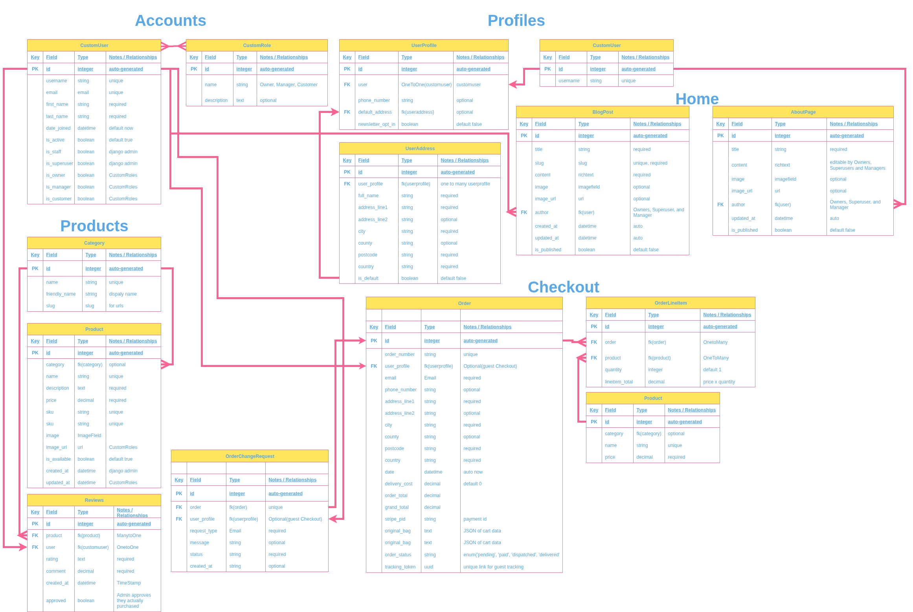

Then the flows of different users were generated.

**General Flow**

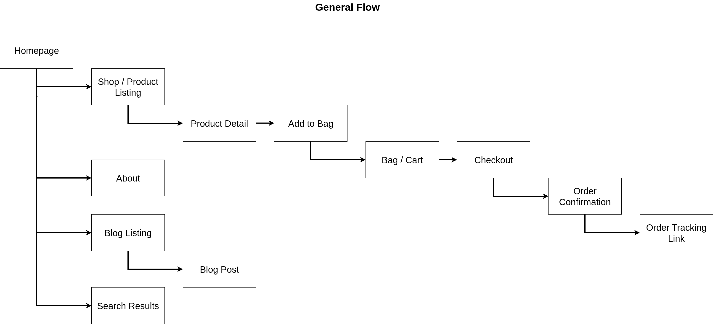

**Signup Flow**

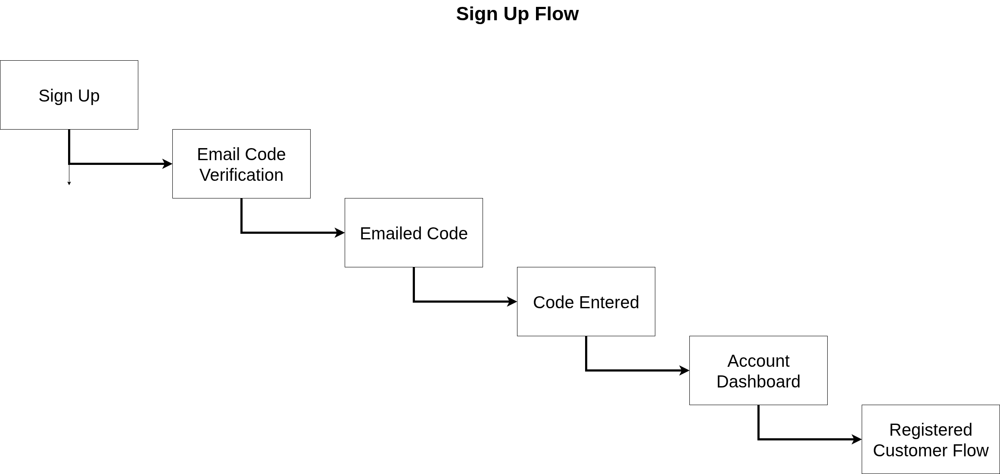

**Registered Customer Flow**

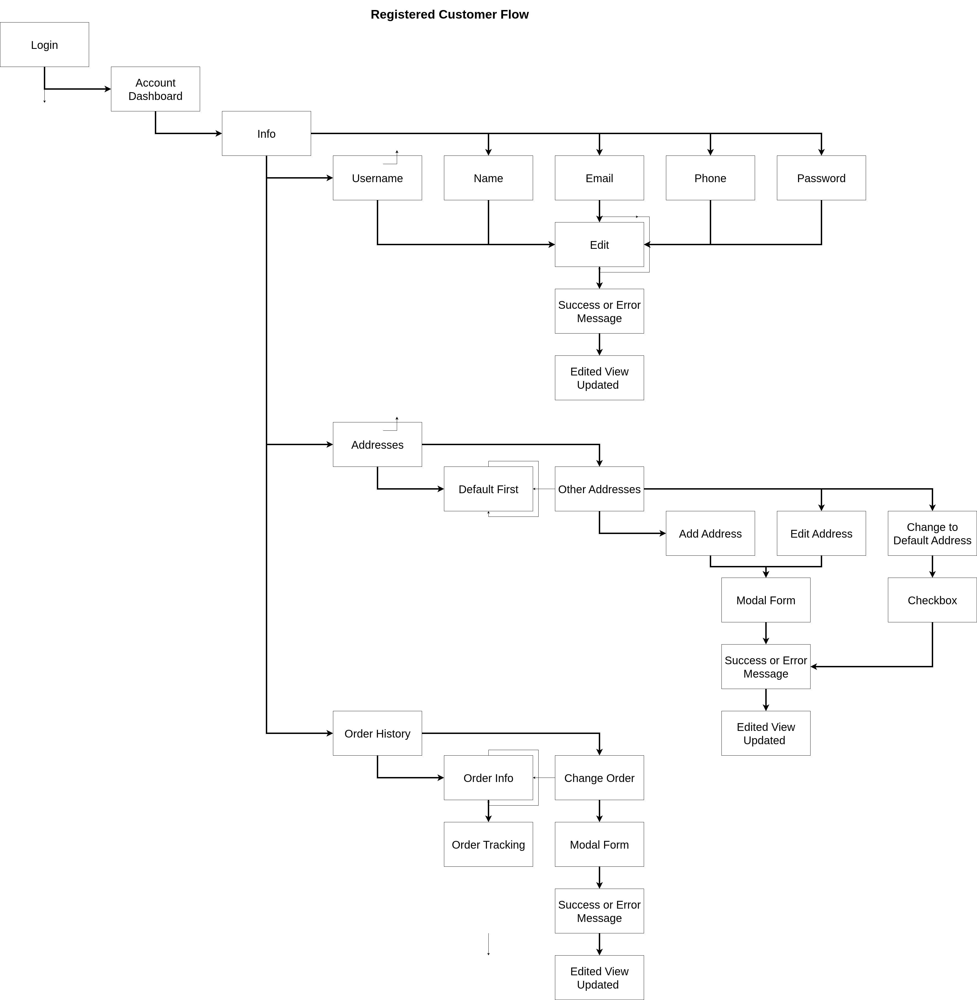

**Admin Flow**

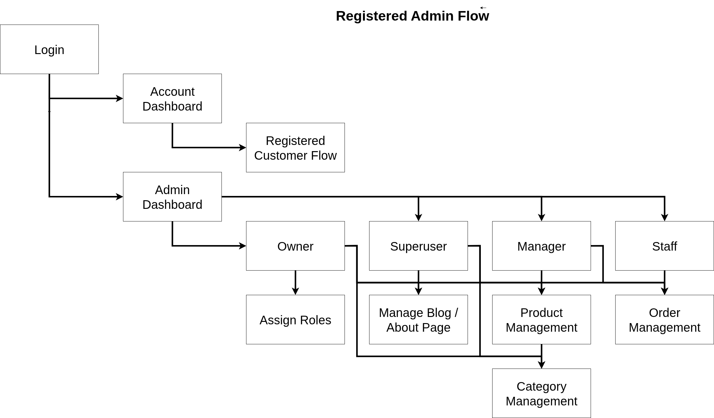

#### Wireframes

Next the below wireframes were generated:

**Homepage**

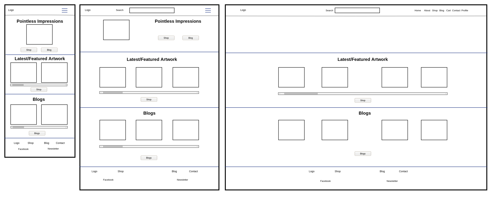

**About**


**Shop**

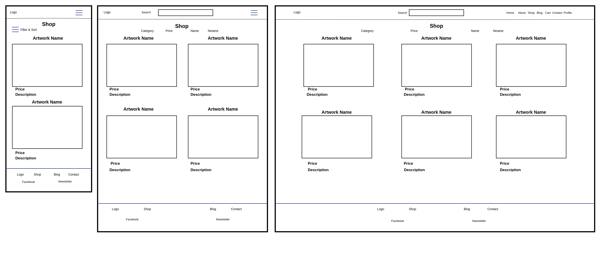

**Product Details**

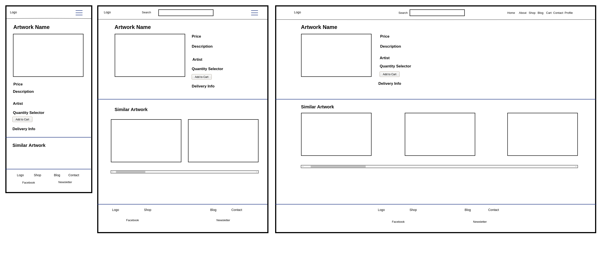

**Checkout**

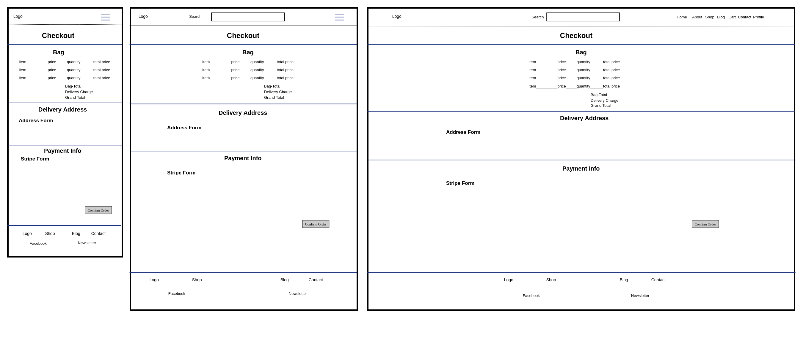

**Account Profile**

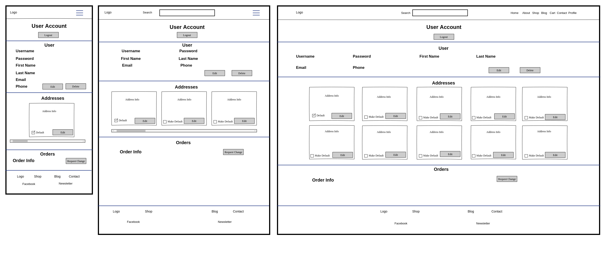

**Blog Index**

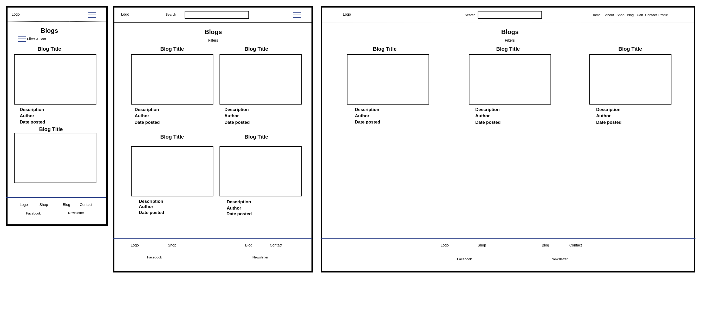

**Blog Page**

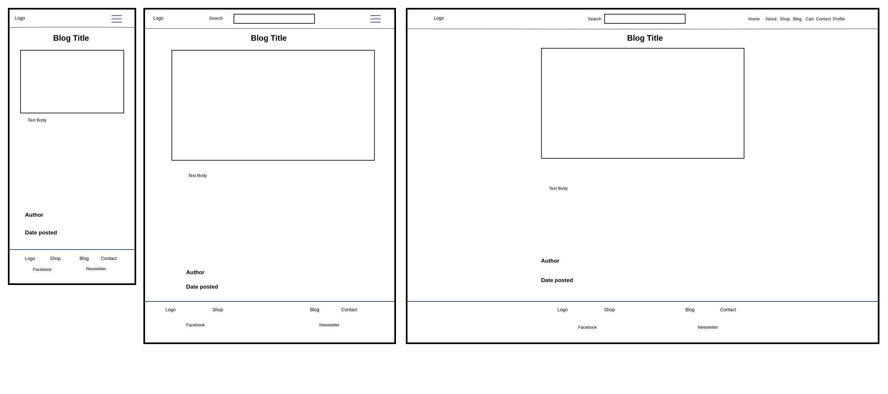

There are other pages planned to do, but time was running out in the planning phase.

Other pages not done include:

1. Signup Form
2. Login Form
3. Logout Success
4. Order Change Request Form
5. Address Add Form
6. Admin Dashboard
7. Admin Add Art Form
8. Admin Update Art Form
9. Delete Art Success

Some of these will be models rather than full pages.

#### Font and Colours

##### Colours

- Logo Colours:
  - Bakground = #fbfcfc (Off-White)
  - Yellow = #fba419
  - Blue = #055187
  - Red = #ec381c
  - Black = #000301
- Header and Footer BG = #055187 (Blue)
- Header and Footer Text = #fbfcfc (Off-White)
- Background = #fbfcfc (Off-White)
- Headings = #000301 (Black)
- Body = #055187 (Blue) or #000301 (Black)
- Form Input BG = #fbfcfc (Off-White)
- Form Input Outline = #055187 (Blue)
- Form Input Placeholder = #05518780 (Blue 50% Opacity)
- Form Input Text = #000301 (Black)
- Buttons = #fba419 (Yellow)
- Buttons on Hover = #ec381c (Red)
- Button Outlines = #055187 (Blue)   
- Button Outlines Hover = #fba419 (Yellow)
- Modals BG = #000301 (Black)
- Modals Outline = #055187 (Blue)
- Modals Header = #fba419 (Yellow)
- Modals Body = #fbfcfc (Off-White)
- Modals Input BG = #fbfcfc (Off-White) 
- Modals input Outline = #055187 (Blue) 
- Modals Input Text = #000301 (Black)
- Modals Buttons = #fba419 (Yellow)
- Modals Buttons on Hover = #ec381c (Red)
- Modals Button Outlines = #055187 (Blue)
- Modals Button Outlines Hover = #fba419 (Yellow)

#### Fonts

- Header and Footer = Poppins
- Headings = Montserrat
- Body = Inter

As you venture to look at the [Features](#features) you will notice some design choices, flow and relationships between the database tables were changed while the project was being made.


---

## Features 

Below are the features for the website and at the end is listed any features that weren't able to be implemented but would be with more time. Please note as this is a resubmission I have not changed the screenshots of the features as they are essentially the same with minor differences.

### SEO Features

I implemented a comprehensive SEO strategy directly within the Django `base.html` template to ensure every page is optimised for search engines and social media sharing. The following features have been implemented:

1. **Dynamic Meta Description**
   - Each page automatically generates a unique meta description based on the page type. Each description is truncated to **155 characters** for SEO best practices and uses `striptags` to remove HTML tags:
     - **Product pages:** Uses the product’s description.  
     - **Blog posts:** Uses the post’s meta description.  
     - **Categories:** Uses the category description.  
     - **About Page:** Uses a custom description highlighting the company’s mission and values.  
     - **Other pages:** Uses a default description promoting the platform and its Pointillism art focus.  
   - Ensures search engines display accurate and relevant snippets in search results.

2. **Dynamic Page Titles**
   - Each page dynamically sets its `<title>` tag and uses `striptags` to remove HTML tags:
     - Product name for product pages.  
     - Post title for blog posts.  
     - Category name for category pages.  
     - Custom titles for the About page and fallback for other pages.  
   - Improves SEO relevance and user click-through rates.

3. **Robots Control**
   - Public pages use `<meta name="robots" content="index, follow" />`.  
   - Private or sensitive pages (login, signup, checkout, account, admin) use `<meta name="robots" content="noindex, nofollow" />` to prevent indexing.  
   - Complemented with a `robots.txt` that references a `sitemap.xml` generated via [Sitemap Generator](https://www.xml-sitemaps.com/).

4. **Open Graph (OG) Tags**
   - OG tags are dynamically generated to optimise social media sharing:
     - **og:title:** Matches the page title dynamically.  
     - **og:description:** Matches the page description dynamically, truncated to **200 characters**, with `striptags` applied.  
     - **og:image:** Uses Cloudinary in production with auto-formatting (`f_auto`) for optimized WebP/AVIF images; local media is used in development.  
     - **og:url:** Automatically set to the page’s absolute URL.  
     - **og:type:** Set as `website`.  
     - **og:site_name:** Set as `Pointless Impressions`.

5. **Canonical URLs**
   - Each page includes a `<link rel="canonical">` pointing to the current absolute URL.  
   - Prevents duplicate content issues by signalling the preferred URL to search engines.

6. **Responsive Meta Tags**
   - `<meta charset="UTF-8" />` ensures proper character encoding.  
   - `<meta name="viewport" content="width=device-width, initial-scale=1.0" />` ensures mobile-friendly, responsive design.

7. **Centralised Management**
   - All SEO-related tags are defined in `base.html` with blocks for overriding if needed:
     - `meta` block for all meta tags.
     - `meta_description` for dynamic descriptions.
     - `meta_robots` for dynamic robots control. 
     - `meta_og_tags` block for Open Graph tags.  
     - `extra_meta` block for page-specific tags like noindex or canonical overrides.

**Result:** Every page of Pointless Impressions is optimised for search engines, social media sharing, and user experience, while sensitive pages are protected from indexing. This setup reduces maintenance overhead by centralising SEO logic in a single template.

### Existing Features

#### Navbar

  - The navbar is dynamic for mobile and non mobile views.
  - The navbar is also dynamic depending on if a user is authenticated or not.


### Features Left to Implement

- Create

---

## Lessons Learnt

- For 

---

## Testing 

The website has been manually and automatically tested.

You can see the manual testing table [here](docs/markdowns/MANUALTESTING.md).

You can see the automatic testing table [here](docs/markdowns/AUTOMATICTESTING.md).

For TDD I used TestCase for Django and Jest for JavaScript

For BDD I used Behave for Django and Cypress for JavaScript

Please note for the Jest and Cypress testing there was a need to create html fixture files as Jest and Cypress don't always read the Django dynamic structure.

### Fixed Bugs

- **Tailwind build failure**: The `npm run dev` and `npm run build` commands were failing because the PostCSS scripts pointed to a non-existent `./src/style.css` file. Updated paths to the correct `src/css/styles.css` file.
- **Clean script issue**: The `rimraf` command in `package.json` was originally wiping folders instead of just their contents. Adjusted it to remove only files inside `static/css` and `static/js`, preserving the directories.
- **Development watcher errors**: Running `python manage.py tailwind start` previously threw `Input Error: You must pass a valid list of files to parse` because PostCSS couldn't locate the source CSS file. This is now fixed with the correct path.
- **Environment isolation**: Development MailDev emails and Redis data were previously accessible from staging or production, which could interfere with live data. This is now fixed by ensuring MailDev only runs in development and each environment has its own Redis instance.
- **Complex CSS override battles**: Removed extensive DaisyUI override CSS (~400+ lines) that were fighting framework defaults with `!important` declarations and complex selectors. Simplified to use clean DaisyUI patterns with custom theming.
- **Navbar structure conflicts**: Fixed duplicate navbar classes where `base.html` had `<header class="navbar">` and `header.html` had redundant `<div class="navbar">` wrapper, causing layout conflicts and CSS selector mismatches.
- **CSS specificity wars**: Eliminated complex selector battles like `header.navbar .navbar-center` vs `.navbar .navbar-center` by restructuring HTML to align with DaisyUI's expected component hierarchy.
- **Mobile layout regressions**: After CSS refactoring, fixed mobile burger menu positioning, search button background, and account/cart buttons being pushed off-screen due to flexbox conflicts.
- **Indentation and structure hierarchy**: Corrected HTML indentation in `header.html` to properly reflect navbar-start/center/end relationship as direct children of navbar container.
- **Brand color inheritance**: Ensured Pointless Impressions brand colors (--pointless-yellow, --pointless-blue, --pointless-red) are properly applied to header, footer, buttons, and navigation elements instead of default DaisyUI colors.
- **Navigation hover states missing**: Added proper hover and active states for navigation menu items to display yellow background (`var(--pointless-yellow)`) with black text on hover, maintaining brand consistency.
- **Header syntax error**: Fixed missing quote in `header.html` (`<div class="w-full>`) that was causing template parsing issues.
- **Button styling inconsistency**: Standardized all buttons to use Pointless branding with yellow background, blue borders, and red hover states while maintaining DaisyUI component structure.
- **Search bar positioning**: Maintained desktop search bar on second level below main navigation while ensuring mobile search toggle functionality works correctly.
- **CSS compilation workflow**: Established proper workflow between source CSS (`theme/static_src/src/css/styles.css`) and compiled output (`static/css/styles.css`) to ensure changes are properly built and deployed.
- **Verbose Quoting**: Made sure all routes were more verbose for deployment purposes. E.g. in `base.py` I added `pointless_impressions_src` to `ROOT_URLCONF = "pointless_impressions_src.pointless_impressions.urls"`.
- **Add __init__.py files**: Added missing `__init__.py` files to ensure proper package structure and module imports.

### Unfixed Bugs

- None

### Validator Testing 

#### Page Speed Insights

- You can click the link to see the results from 27th August in the evening.
- You can switch between the mobile and desktop results as well.
- The tests were only run for the unauthenticated users.

  - [Homepage results]()

#### HTML

- Homepage
  


#### CSS

- Due to using Django-Tailwind the Jigsaw validator had errors. 
- All errors were to do with the @layer, @property and so forth. Therefore, I deemed it was all valid.

 

#### JS

No errors were returned when passing through the official JS Hint, see images below for each page.

  - Alert JS
    
  

---

## Deployment

The app deployed via Heroku [here]() following the steps below:

1. **Ensure you run commands before committing**

   1. Build the requirements files

      1. Navigate to your `.venv` or virtual environment or create one if you haven't already.

        ```bash
        python -m venv .venv
        source .venv/bin/activate  # Linux/Mac
        .venv\Scripts\activate     # Windows
        ```

        If python or pip don't work ensure you can run this as:

        ```bash
        python3 -m venv .venv
        source .venv/bin/activate  # Linux/Mac
        .venv\Scripts\activate     # Windows
        ```
      2. Run the command below to build the `requirements.txt` file

        ```bash
        pip freeze > requirements.txt
        ```

        If python or pip don't work ensure you can run this as:

        ```bash
        pip3 freeze > requirements.txt
        ```

  2. **Update Packages**

      1. In the `.venv` or virtual environment navigate to the `theme/static_src` folder and run the command below to update the npm packages

        1. Install to update the `package-lock.json` file

        ```bash
        npm install
        ```

        2. Run the command below to update the `package.json` file

        ```bash
        npm update
        ```
        3. Build the Tailwind CSS and JS files

        ```bash
        npm run build
        ```

        **IMPORTANT** As we are also using Django-Tailwind you can run from the root `python manage.py tailwind build` or `python3 manage.py tailwind build` command to build the Tailwind CSS files as well.

        Either way ensures the `static/css/styles.css` and `static/js/scripts.js` files are updated and hashed for caching purposes on deployment.

        If python or pip don't work ensure you can run this as:

        ```bash
        pip3 install --upgrade pip setuptools wheel
        ```
2. **Create your Procfile file**

   1. In the root of your project create a `Procfile` file with the following content:

      ```
      web: gunicorn pathtosettings.wsgi:application
      ```

   2. In the root of your project create a `.python-version` file with the following content:

      ```
      3.13
      ```

3. **Create your .slugignore file**
   
   1. In the root of your project create a `.slugignore` file with the following content:

      ```
      # -----------------------------
      # Markdown
      # -----------------------------
      *.md
      docs/

      # -----------------------------
      # Environment Example files 
      # -----------------------------
      .env.dev.example
      .env.staging.example
      .env.production.example

      # -----------------------------
      # Docker Files
      # -----------------------------
      /**/*-entrypoint.sh
      .dockerignore
      Dockerfile.*
      docker-compose.*.yml
      *.sh
      redis.conf

      # -----------------------------
      # Tests
      # -----------------------------
      **/static_src/cypress.config.js
      **/static_src/jest.config.js
      **/static_src/src/tests.js

      # -----------------------------
      # Generated / local CSS (will be hashed in build)
      # -----------------------------
      **/static/css/styles.css
      ```

      **IMPORTANT** This will stop the files being uploaded to Heroku which are not needed for production or staging deployment. As we aren't able to use the Docker images due to having a student Heroku account. We also don't need the tests or markdown files on the live server. We are also hashing the CSS and JS files during the build process so the un-hashed built CSS files are not needed.

4. **Git Commit**

   1. Run the command below to check which branch you are on

      ```bash
      git branch
      ```

   2. If you are not on the `staging` branch for staging deployment or the `main` branch for production deployment, run the command below to switch to it

      For Staging:
      ```bash
      git checkout staging
      ```

      For Production:
      ```bash
      git checkout main
      ```
    3. Run the commands below to add, commit and push the changes to the relevant branch

        For Staging:
        ```bash
        git add .
        git commit -m "Your commit message"
        git push origin staging
        ```

        For Production:
        ```bash
        git add .
        git commit -m "Your commit message"
        git push origin main
        ```

5. **Set up Cloudinary for Staging Media Storage**

    1. Log into your [Cloudinary Dashboard](https://cloudinary.com/console)
    
    2. Create a new folder for staging environment:
       - Navigate to Media Library
       - Click "Create Folder" 
       - Name it something relevant if for staging include staging, if for production just the name of the project
       - Note down your Cloud Name, API Key, and API Secret from the dashboard

6. **Set up Email for Correct Deployment**

   1. **Staging Environment - Ethereal Email**
      1. Go to [Ethereal Email](https://ethereal.email/)
      2. Click "Create Ethereal Account" to generate test credentials
      3. Note down the SMTP settings:
       - Host: 
       - Port: 
       - Username: [generated username]
       - Password: [generated password]
       - Use TLS: 
      4. Save the web interface URL to view sent emails during testing
  
   2. **Production Environment - Gmail**
      1. Go to your [Google Account Security Settings](https://myaccount.google.com/security)
      2. Under "Signing in to Google," enable 2-Step Verification
      3. After enabling 2-Step Verification, go to "App Passwords"
      4. Create an app password for "Mail" on "Other (Custom name)" and name it "Django App"
      5. Note down the generated app password for SMTP use
      6. Use the following SMTP settings in your production environment:
       - Host: 
       - Port: 
       - Username: your full Gmail address
       - Password: the generated app password
       - Use TLS: 

7. **Set up AWS S3 Bucket and IAM for Staging**

   1. **Create AWS Account (if not already done):**
       - Go to [AWS Signup](https://aws.amazon.com/)
       - Follow the steps to create a new account

   2. **Create S3 Bucket:**
       - Log into AWS Console
       - Navigate to S3 service
       - Click "Create bucket"
       - Bucket name: choose a name that is globally unique.
       - Region: Choose closest to your users (e.g., eu-west-2 for UK)
       - Uncheck "Block all public access" for media files
       - Enable versioning (optional but recommended)
       - Click "Create bucket"

   3. **Configure Bucket Policy:**
       - Go to bucket → Permissions → Bucket Policy
       - Add policy for public read access to static files:
       ```json
       {
         "Version": "2012-10-17",
         "Statement": [
           {
             "Sid": "PublicReadGetObject",
             "Effect": "Allow",
             "Principal": "*",
             "Action": "s3:GetObject",
             "Resource": "arn"
           }
         ]
       }
       ```

   4. **Configure CORS:**
       - Go to bucket → Permissions → Cross-origin resource sharing (CORS)
       - Add CORS configuration:
       ```json
       [
         {
           "AllowedHeaders": ["*"],
           "AllowedMethods": ["GET", "POST", "PUT", "DELETE"],
           "AllowedOrigins": ["*"],
           "ExposeHeaders": ["ETag"],
           "MaxAgeSeconds": 3000
         }
       ]
       ```

    5. **Create IAM Policy:**
       - Navigate to IAM → Policies
       - Click "Create policy"
       - Select "JSON" tab and add the following policy (replace `your-bucket-name`):
       ```json
       {
         "Version": "2012-10-17",
         "Statement": [
           {
             "Effect": "Allow",
             "Action": [
               "s3:PutObject",
               "s3:GetObject",
               "s3:DeleteObject",
               "s3:ListBucket"
             ],
             "Resource": [
               "arn",
               "arn/*"
             ]
           }
         ]
       }
       ```
       - Click "Next: Tags" → "Next: Review"
       - Name: Global Name
       - Description (optional): Describe whether it is for staging or production
       - Click "Create policy"

    6. **Create IAM User Groups:**

       **Service Group (for applications):**
       - Navigate to IAM → User groups
       - Click "Create group"
       - Group name: global name
       - Description: Descriube whether it is for staging or production
       - Attach the policy: policy name
       - Click "Create group"

       **Developer Group (for human users):**
       - Click "Create group"
       - Group name: global name 
       - Description: Descriube whether it is for staging or production
       - Attach policies:
         - Policy Name (custom policy created above)
         - `CloudWatchLogsReadOnlyAccess` (AWS managed - for debugging)
         - `IAMReadOnlyAccess` (AWS managed - to view their own permissions)
       - Click "Create group"

    7. **Create IAM User:**
       - Navigate to IAM → Users
       - Click "Create user"
       - Username: Global Name
       - Select "Programmatic access"
       - Click "Next"

    8. **Add User to Service Group:**
       - On the permissions page, select "Add user to group"
       - Select User Groups Global Name you created earlier
       - Click "Next" → "Create user"
       - **Important:** Download the Access Key ID and Secret Access Key
       - Store these securely - they won't be shown again

8. **Create Heroku App:**
   1. Navigate to Heroku Dashboard
   2. Click "New" → "Create new app"
   3. App name: Global Name
   4. Choose region: EU
   5. Click "Create app"

9. **Create Config Vars:**
   1. In the Heroku app dashboard, navigate to "Settings" → "Config Vars"
   2. Add all necessary environment variables as per your `.env.production.example` or `.env.staging.example` files.
   3. Ensure to include AWS, Cloudinary, Email, and Django secret key settings.
   4. Save each variable after adding.

    As an example make sure you have the following variables set:

    ```plaintext
    ALLOWED_HOSTS=
    DEBUG=FALSE
    DJANGO_SECRET_KEY= 
    DJANGO_DEBUG=False 
    DJANGO_ALLOWED_HOSTS= 
    DJANGO_SETTINGS_MODULE= 
    STAGING/PRODUCTION_DB_URL= 
    EMAIL_BACKEND= 
    EMAIL_HOST= 
    EMAIL_PORT= 
    EMAIL_USE_TLS= 
    EMAIL_HOST_USER= 
    EMAIL_HOST_PASSWORD= 
    DEFAULT_FROM_EMAIL= 
    CLOUDINARY_CLOUD_NAME= 
    CLOUDINARY_API_KEY= 
    CLOUDINARY_API_SECRET= 
    AWS_STORAGE_BUCKET_NAME= 
    AWS_S3_REGION_NAME= 
    AWS_ACCESS_KEY_ID= 
    AWS_SECRET_ACCESS_KEY= 
    STRIPE_PUBLIC_KEY= 
    STRIPE_SECRET_KEY= 
    STRIPE_WH_SECRET= 
    ```

10. **Deploy the App:**
    1. In the Heroku app dashboard, navigate to "Deploy" tab
    2. Under "Deployment method," select "GitHub"
    3. Connect to your GitHub account and select the repository
    4. Set up automatic deploys if desired using the correct branch (`staging` for staging deployment or `main` for production deployment)
    5. Choose the branch (`staging` for staging deployment or `main` for production deployment)
    6. Click "Deploy Branch"
    7. Monitor the build logs for any errors
    8. Once deployed, click "View" to see your live application

Due to having a student Heroku account the Docker container deployment option is not available, due to file size limitations.

I have also written how to deploy using the Docker files for [Production Deployment using Docker Container](docs/markdowns/PRODUCTION.md).

It is important to note to simulate a real world environment I also deployed a staging version of the web app via Heroku [here]() and I followed the steps outlined in [Staging Deploymennt using Docker Container](docs/markdowns/STAGING.md)

As I used a Docker Contianer I set the Python Version and gunicorn in my relevant Docker related files:

### Production Files

1. [Dockerfile](Dockerfile.production)
2. [Dcoker Compose](docker-compose.production.yml)
3. [Entrypoint](pointless_impressions_src/production-entrypoint.sh)
4. [Env Example](.env.production.example)
5. [Production Settings](pointless_impressions_src/pointless_impressions/settings/production.py)

### Staging Files

1. [Dockerfile](Dockerfile.staging)
2. [Dcoker Compose](docker-compose.staging.yml)
3. [Entrypoint](pointless_impressions_src/staging-entrypoint.sh)
4. [Env Example](.env.staging.example)
5. [Production Settings](pointless_impressions_src/pointless_impressions/settings/staging.py)

---

## Cloning

At the top of this document is a link to the guide to clone to help with development.

Please follow this [Cloning and Development](docs/markdowns/DEVELOPMENT.md)

 
## Credits 

Below are my credits for where I got inspiration for some of the code and content

- To help me understand how to implement Docker with Django I used [Docker - Django and PostgreSQL setup (with uv) from scratch! by BugBytes](https://www.youtube.com/watch?v=37aNpE-9dD4&t=524s)
- To understand uv package manager and modern Python dependency management I used [uv: Python's New Package Manager by BugBytes](https://www.youtube.com/watch?v=_FdjW47Au30)
- To help improve my understanding of meta tage I looked at [Meta Tags Google Support](https://www.semrush.com/blog/meta-tag/?g_acctid=152-012-3634&g_adid=767193674768&g_adgroupid=149553965890&g_network=g&g_adtype=search&g_keyword=&g_keywordid=dsa-2185834090056&g_campaignid=18352326857&g_campaign=UK_SRCH_DSA_Blog_EN&kw=&cmp=UK_SRCH_DSA_Blog_EN&label=dsa_pagefeed&Network=g&Device=c&utm_content=767193674768&kwid=dsa-2185834090056&cmpid=18352326857&agpid=149553965890&BU=Core&extid=279889846583&adpos=&matchtype=&gad_source=1&gad_campaignid=18352326857&gclid=CjwKCAjwu9fHBhAWEiwAzGRC_-teJyIG_ANaSCkqwUocd1HZOJeb2tReI3nyEP6C-cOVMI71hg0U6BoCHtYQAvD_BwE)
- Keywords meta tag is no longer supported or encouraged for SEO, hence why they are minimally used. My source was [Semrush Article](https://www.semrush.com/blog/meta-keywords/?g_acctid=152-012-3634&g_adid=767053397457&g_adgroupid=149553965890&g_network=g&g_adtype=search&g_keyword=&g_keywordid=dsa-2185834090056&g_campaignid=18352326857&g_campaign=UK_SRCH_DSA_Blog_EN&kw=&cmp=UK_SRCH_DSA_Blog_EN&label=dsa_pagefeed&Network=g&Device=c&utm_content=767053397457&kwid=dsa-2185834090056&cmpid=18352326857&agpid=149553965890&BU=Core&extid=279966777342&adpos=&matchtype=&gad_source=1&gad_campaignid=18352326857&gclid=CjwKCAjwu9fHBhAWEiwAzGRC_24eTlVF0HbH8ahzdYsMy02RFznsJt5_Bkz_fcM2fByAM7rYrErlgBoC8bYQAvD_BwE)
- To underrstand striptags I used [Django Striptags Docs](https://docs.djangoproject.com/en/5.2/ref/templates/builtins/#striptags)
- For Django settings best practices and environment configuration I referenced [Django Settings Best Practices by Daniel Roy Greenfeld](https://django-environ.readthedocs.io/en/latest/)
- To understand Django logging configuration I used [Django Logging Documentation](https://docs.djangoproject.com/en/5.2/topics/logging/)
- For database connection pooling and optimization I referenced [Django Database Optimization Guide](https://docs.djangoproject.com/en/5.2/topics/db/optimization/)
- To implement Redis caching properly I used [Django Redis Documentation](https://django-redis.readthedocs.io/en/latest/)
- For Django security settings and HTTPS configuration I referenced [Django Security Documentation](https://docs.djangoproject.com/en/5.2/topics/security/)
- To understand environment-specific settings structure I used [The Twelve-Factor App Methodology](https://12factor.net/config)
- For Django email configuration and backends I referenced [Django Email Documentation](https://docs.djangoproject.com/en/5.2/topics/email/)
- To implement proper Django cache fallback strategies I used [Django Cache Framework Documentation](https://docs.djangoproject.com/en/5.2/topics/cache/)
- For Heroku deployment configuration I referenced [Heroku Django Deployment Guide](https://devcenter.heroku.com/articles/django-app-configuration)
- For Docker multi-stage builds and optimization I referenced [Docker Multi-Stage Builds Documentation](https://docs.docker.com/build/building/multi-stage/)
- To understand Docker Compose health checks and service dependencies I used [Docker Compose Health Check Guide](https://docs.docker.com/compose/compose-file/compose-file-v3/#healthcheck)
- For Docker container security and non-root user best practices I referenced [Docker Security Best Practices](https://docs.docker.com/develop/dev-best-practices/)
- To implement proper Docker entrypoint scripts I used [Docker Entrypoint Best Practices](https://docs.docker.com/develop/dev-best-practices/#how-to-keep-your-images-small)
- For Gunicorn production configuration and worker optimization I referenced [Gunicorn Deployment Documentation](https://docs.gunicorn.org/en/stable/deploy.html)
- To understand container orchestration and volume management I used [Docker Compose Production Guide](https://docs.docker.com/compose/production/)
- For DaisyUI component implementation and theming I referenced [DaisyUI Documentation](https://daisyui.com/docs/install/)
- To understand DaisyUI theme customization and CSS variables I used [DaisyUI Themes Guide](https://daisyui.com/docs/themes/)
- For Tailwind CSS v4 configuration and @layer usage I referenced [Tailwind CSS v4 Documentation](https://tailwindcss.com/docs/installation)
- To understand CSS custom properties and oklch() color values I used [MDN CSS Custom Properties](https://developer.mozilla.org/en-US/docs/Web/CSS/--*)
- For navbar component structure and responsive design patterns I referenced [DaisyUI Navbar Component](https://daisyui.com/components/navbar/)
- To understand CSS specificity and cascade management I used [MDN CSS Specificity](https://developer.mozilla.org/en-US/docs/Web/CSS/Specificity)
- For CSS @layer directive and cascade layers I referenced [MDN CSS @layer](https://developer.mozilla.org/en-US/docs/Web/CSS/@layer)
- To implement proper button component styling I used [DaisyUI Button Component](https://daisyui.com/components/button/)
- For dropdown and menu component implementation I referenced [DaisyUI Dropdown](https://daisyui.com/components/dropdown/) and [DaisyUI Menu](https://daisyui.com/components/menu/)
- To understand CSS framework override strategies I referenced [CSS-Tricks: Working with CSS Frameworks](https://css-tricks.com/considerations-for-styling-a-modal/)
- For responsive navbar patterns and mobile-first design I used [A Complete Guide to Flexbox by CSS-Tricks](https://css-tricks.com/snippets/css/a-guide-to-flexbox/)
- For .slugignore best practices I referenced [Heroku Slugignore Documentation](https://devcenter.heroku.com/articles/slug-compiler#slugignore)
- For setting up AWS S3 buckets and IAM policies I referenced [AWS S3 Getting Started Guide](https://docs.aws.amazon.com/AmazonS3/latest/userguide/Welcome.html) and [AWS IAM User Guide](https://docs.aws.amazon.com/IAM/latest/UserGuide/introduction.html)
- For Django-Cloudinary integration I used [Cloudinary Django Documentation](https://cloudinary.com/documentation/django_integration)
