# Pointless Impressions

---

## Table of Contents

- [Pointless Impressions](#pointless-impressions)
  - [Table of Contents](#table-of-contents)
  - [Development Guide](#development-guide)
  - [Pointless Impressions](#pointless-impressions-1)
    - [Planning Process](#planning-process)
      - [Business Plan and User Stories](#business-plan-and-user-stories)
      - [Database Plan](#database-plan)
      - [Wireframes](#wireframes)
      - [Font and Colours](#font-and-colours)
        - [Colours](#colours)
      - [Fonts](#fonts)
  - [Features](#features)
    - [SEO Features](#seo-features)
    - [Existing Features](#existing-features)
      - [Header \& Navigation (Responsive Navbar)](#header--navigation-responsive-navbar)
      - [Footer](#footer)
      - [Homepage](#homepage)
      - [Artwork List Page](#artwork-list-page)
      - [Artwork Detail Page](#artwork-detail-page)
      - [Add to Cart Modal](#add-to-cart-modal)
      - [Checkout Page](#checkout-page)
      - [Toast Notification System](#toast-notification-system)
      - [Integration Features](#integration-features)
    - [Features Left to Implement](#features-left-to-implement)
  - [Lessons Learnt](#lessons-learnt)
  - [Testing](#testing)
    - [Fixed Bugs](#fixed-bugs)
    - [Unfixed Bugs](#unfixed-bugs)
    - [Validator Testing](#validator-testing)
      - [Page Speed Insights](#page-speed-insights)
      - [HTML](#html)
      - [CSS](#css)
      - [JS](#js)
  - [Deployment](#deployment)
    - [Production Files](#production-files)
    - [Staging Files](#staging-files)
  - [Cloning](#cloning)
  - [Credits](#credits)
    - [Existing Features Credits](#existing-features-credits)
    - [Removed Features Credits as not used anymore](#removed-features-credits-as-not-used-anymore)

---

## Development Guide

Please read [Development Markdown](docs/markdowns/DEVELOPMENT.md) before developing.

---

## Pointless Impressions

### Planning Process

#### Business Plan and User Stories

The decision to make this website is due to the [B2C Business Plan](docs/markdowns/BUSINESSPLAN.md). Please note this has teh keywords for SEO in it as well.

This led to this [User Stories Backlog](docs/markdowns/USERSTORYBACKLOG.md) being made and agreed with the client.

You can also see how the user stories were made into [Sprints](docs/markdowns/SPRINTS.md).

As we progressed in the project some of the sprints were skipped due to time. You can see more in [Features](#features) section, especially [Features Left to Implement](#features-left-to-implement).

#### Database Plan

Following on from the Sprints the [Database Tables](docs/markdowns/DATABASEPLAN.md) were made, which then had the ERDs visually made.

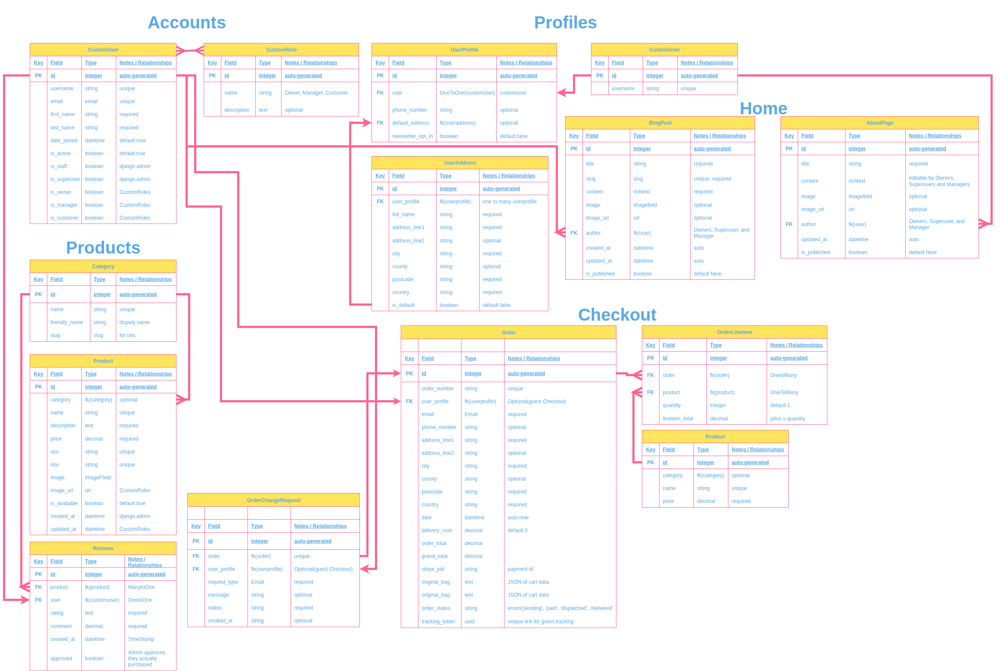

Then the flows of different users were generated.

**General Flow**

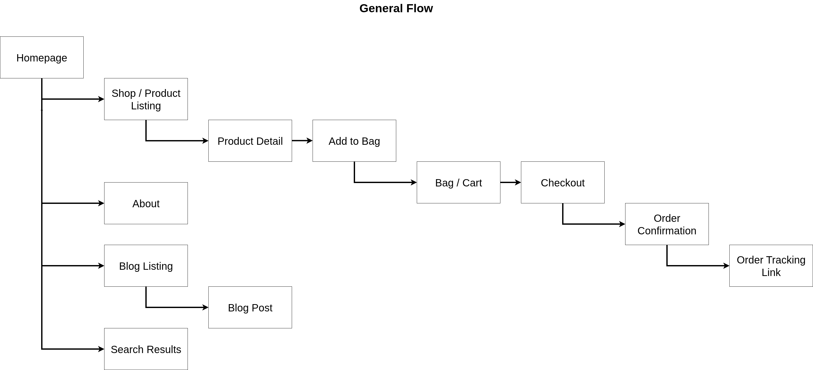

**Signup Flow**

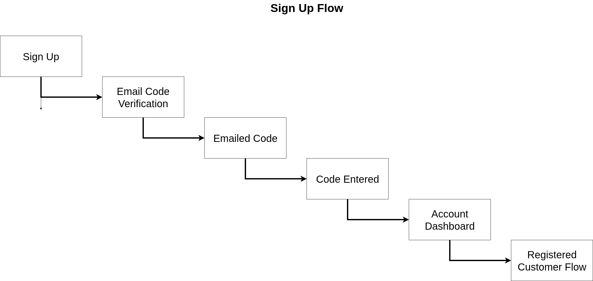

**Registered Customer Flow**

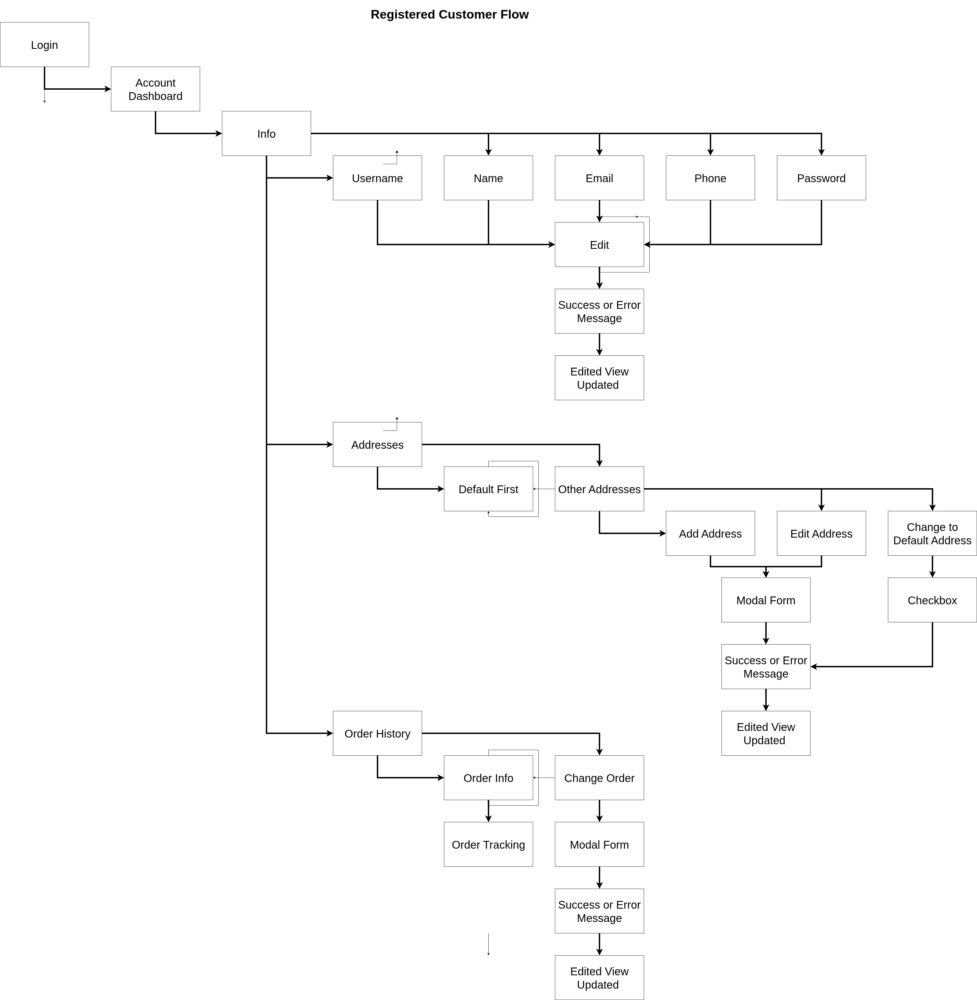

**Admin Flow**

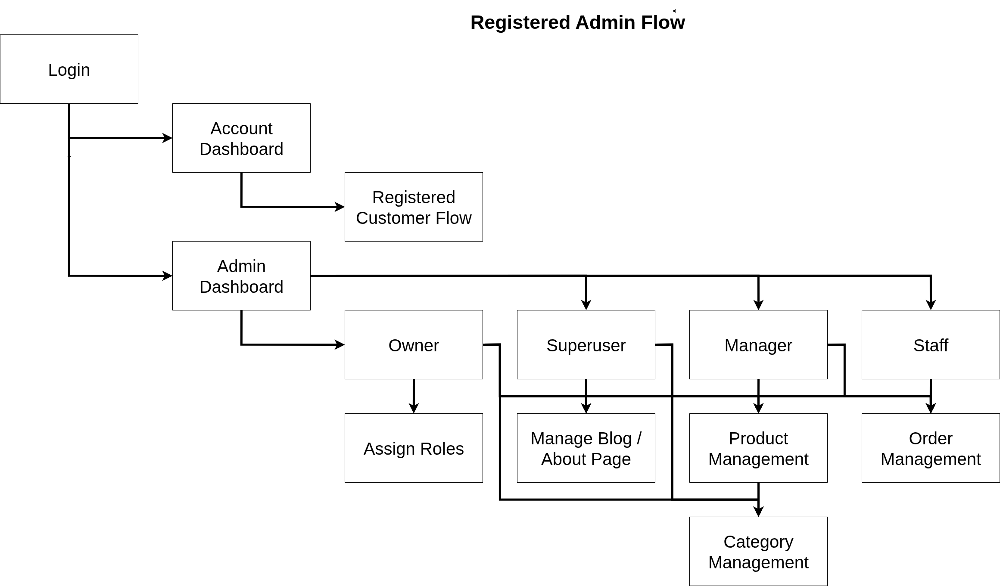

#### Wireframes

Next the below wireframes were generated:

**Homepage**

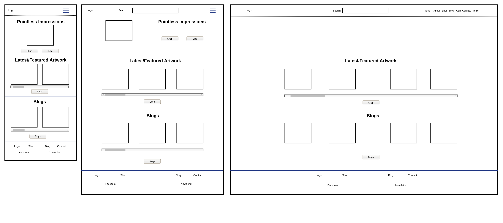

**About**


**Shop**

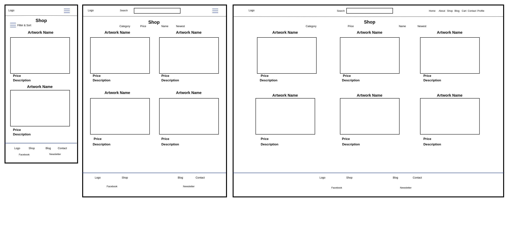

**Product Details**

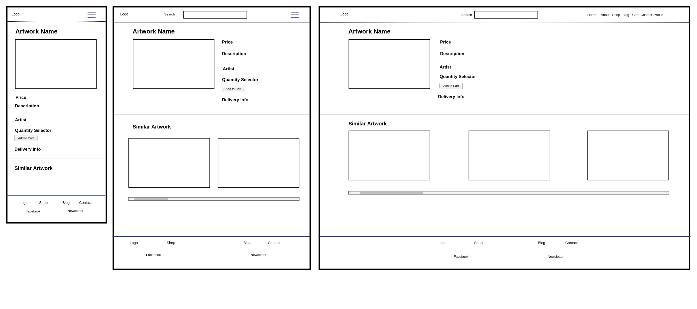

**Checkout**

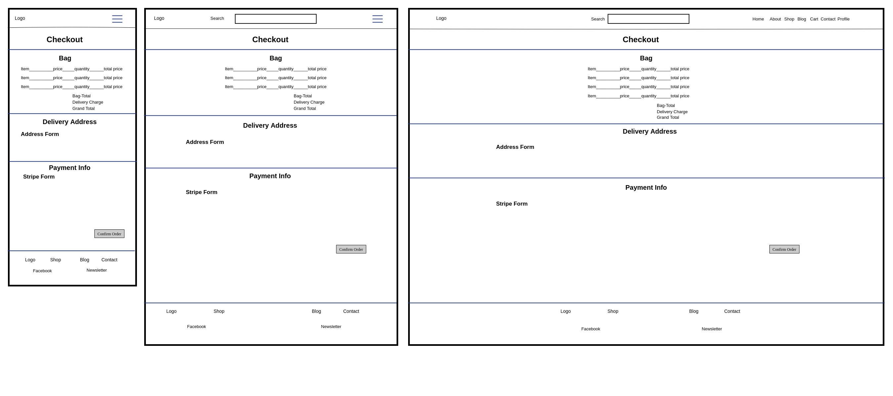

**Account Profile**

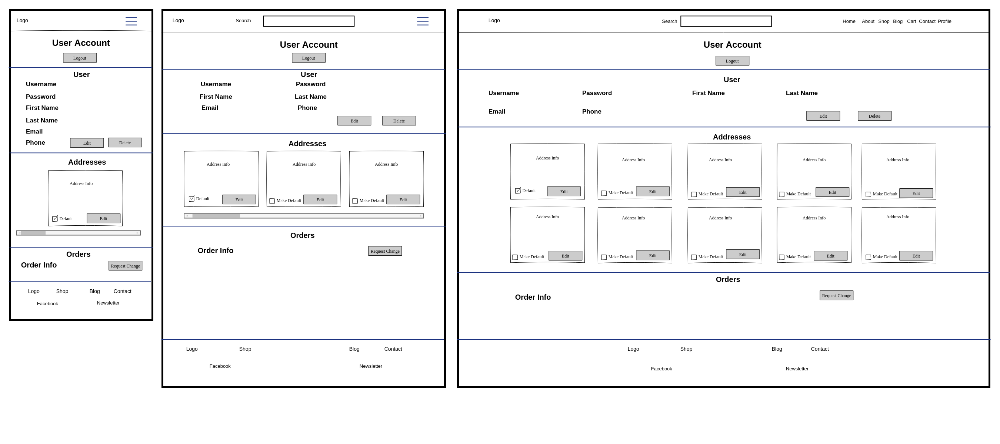

**Blog Index**

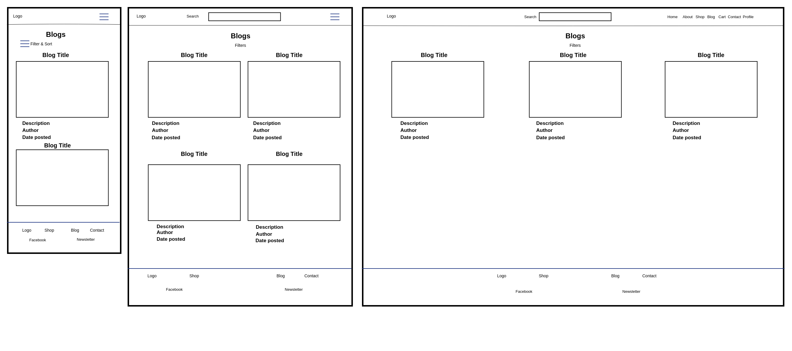

**Blog Page**

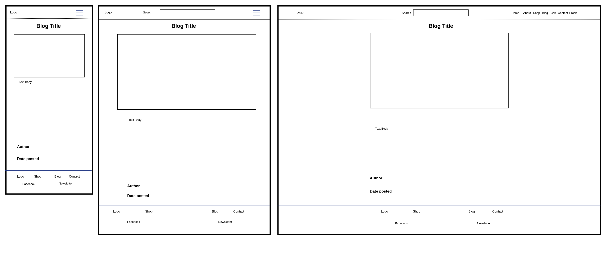

There are other pages planned to do, but time was running out in the planning phase.

Other pages not done include:

1. Signup Form
2. Login Form
3. Logout Success
4. Order Change Request Form
5. Address Add Form
6. Admin Dashboard
7. Admin Add Art Form
8. Admin Update Art Form
9. Delete Art Success

Some of these will be models rather than full pages.

#### Font and Colours

##### Colours

- Logo Colours:
  - Bakground = #fbfcfc (Off-White)
  - Yellow = #fba419
  - Blue = #055187
  - Red = #ec381c
  - Black = #000301
- Header and Footer BG = #055187 (Blue)
- Header and Footer Text = #fbfcfc (Off-White)
- Background = #fbfcfc (Off-White)
- Headings = #000301 (Black)
- Body = #055187 (Blue) or #000301 (Black)
- Form Input BG = #fbfcfc (Off-White)
- Form Input Outline = #055187 (Blue)
- Form Input Placeholder = #05518780 (Blue 50% Opacity)
- Form Input Text = #000301 (Black)
- Buttons = #fba419 (Yellow)
- Buttons on Hover = #ec381c (Red)
- Button Outlines = #055187 (Blue)   
- Button Outlines Hover = #fba419 (Yellow)
- Modals BG = #000301 (Black)
- Modals Outline = #055187 (Blue)
- Modals Header = #fba419 (Yellow)
- Modals Body = #fbfcfc (Off-White)
- Modals Input BG = #fbfcfc (Off-White) 
- Modals input Outline = #055187 (Blue) 
- Modals Input Text = #000301 (Black)
- Modals Buttons = #fba419 (Yellow)
- Modals Buttons on Hover = #ec381c (Red)
- Modals Button Outlines = #055187 (Blue)
- Modals Button Outlines Hover = #fba419 (Yellow)

#### Fonts

- Header and Footer = Poppins
- Headings = Montserrat
- Body = Inter

As you venture to look at the [Features](#features) you will notice some design choices, flow and relationships between the database tables were changed while the project was being made.


---

## Features 

Below are the features for the website and at the end is listed any features that weren't able to be implemented but would be with more time. Please note as this is a resubmission I have not changed the screenshots of the features as they are essentially the same with minor differences.

### SEO Features

I implemented a comprehensive SEO strategy directly within the Django `base.html` template to ensure every page is optimised for search engines and social media sharing. The following features have been implemented:

1. **Dynamic Meta Description**
   - Each page automatically generates a unique meta description based on the page type. Each description is truncated to **155 characters** for SEO best practices and uses `striptags` to remove HTML tags:
     - **Product pages:** Uses the product’s description.  
     - **Blog posts:** Uses the post’s meta description.  
     - **Categories:** Uses the category description.  
     - **About Page:** Uses a custom description highlighting the company’s mission and values.  
     - **Other pages:** Uses a default description promoting the platform and its Pointillism art focus.  
   - Ensures search engines display accurate and relevant snippets in search results.

2. **Dynamic Page Titles**
   - Each page dynamically sets its `<title>` tag and uses `striptags` to remove HTML tags:
     - Product name for product pages.  
     - Post title for blog posts.  
     - Category name for category pages.  
     - Custom titles for the About page and fallback for other pages.  
   - Improves SEO relevance and user click-through rates.

3. **Robots Control**
   - Public pages use `<meta name="robots" content="index, follow" />`.  
   - Private or sensitive pages (login, signup, checkout, account, admin) use `<meta name="robots" content="noindex, nofollow" />` to prevent indexing.  
   - Complemented with a `robots.txt` that references a `sitemap.xml` generated via [Sitemap Generator](https://www.xml-sitemaps.com/).

4. **Open Graph (OG) Tags**
   - OG tags are dynamically generated to optimise social media sharing:
     - **og:title:** Matches the page title dynamically.  
     - **og:description:** Matches the page description dynamically, truncated to **200 characters**, with `striptags` applied.  
     - **og:image:** Uses Cloudinary in production with auto-formatting (`f_auto`) for optimized WebP/AVIF images; local media is used in development.  
     - **og:url:** Automatically set to the page’s absolute URL.  
     - **og:type:** Set as `website`.  
     - **og:site_name:** Set as `Pointless Impressions`.

5. **Canonical URLs**
   - Each page includes a `<link rel="canonical">` pointing to the current absolute URL.  
   - Prevents duplicate content issues by signalling the preferred URL to search engines.

6. **Responsive Meta Tags**
   - `<meta charset="UTF-8" />` ensures proper character encoding.  
   - `<meta name="viewport" content="width=device-width, initial-scale=1.0" />` ensures mobile-friendly, responsive design.

7. **Centralised Management**
   - All SEO-related tags are defined in `base.html` with blocks for overriding if needed:
     - `meta` block for all meta tags.
     - `meta_description` for dynamic descriptions.
     - `meta_robots` for dynamic robots control. 
     - `meta_og_tags` block for Open Graph tags.  
     - `extra_meta` block for page-specific tags like noindex or canonical overrides.

**Result:** Every page of Pointless Impressions is optimised for search engines, social media sharing, and user experience, while sensitive pages are protected from indexing. This setup reduces maintenance overhead by centralising SEO logic in a single template.

### Existing Features

#### Header & Navigation (Responsive Navbar)

**Desktop View:**
- **Logo**: Clickable Pointless Impressions logo (top-left) with fallback text branding
- **Primary Navigation Menu** (visible on md+ screens):
  - Home, Shop (with dropdown: Categories, Framing Options, Artists), Blog, About, Contact
  - Each link styled with hover states (yellow background, black text)
- **Search Button**: Top-right icon button with "Search" label (visible on desktop)
- **Account Dropdown**: Profile picture if authenticated, user icon if guest; expandable menu showing profile options
- **Cart Dropdown**: Shows item count badge and subtotal (expandable)
- **Responsive Grid Layout**: Items evenly distributed with navbar-start/center/end sections

**Mobile View:**
- **Hamburger Menu**: Collapsible navigation drawer revealing Shop, Blog, About, Contact
- **Logo**: Scaled appropriately for smaller screens
- **Search Icon**: Visible in mobile menu, integrated with search functionality
- **Account/Cart Buttons**: Positioned in navbar-end, accessible without hamburger
- **Touch-Friendly**: Larger tap targets, stacked layout for readability

**Authentication States:**
- **Logged In**: Shows user profile picture, username in dropdown, "Profile" and "Logout" options
- **Guest**: Shows generic user icon, "Login" and "Signup" options in dropdown
- **Authenticated Features Unlock**: Account menu expands with order history, saved addresses, preferences

**User Interactions:**
- Hover effects on navigation items (yellow highlight with smooth transitions)
- Dropdown menus expand/collapse on click
- Search button triggers search modal/page
- Cart button shows mini-cart preview with quick access to checkout
- Account menu shows recent orders and quick links

**Cart Dropdown in Header:**
- The cart icon in the header displays a badge with the current item count and subtotal.
- Clicking the cart icon reveals a dropdown showing all cart items in a table with image, name, quantity, and price.
- Users can quickly review their cart contents and subtotal without leaving the current page.
- The dropdown updates instantly after any cart change (add, update, remove) via AJAX.
- Clicking "View Cart" in the dropdown takes the user directly to the checkout page.

**Real-Time Updates & Persistence:**
- Cart state is persisted using localStorage and synchronized with the backend session.
- All cart actions (add, update, remove) trigger real-time UI updates in the header dropdown and badge.
- Cart remains consistent across page reloads and navigation.

---

#### Footer

**Content Sections (Responsive Grid):**
- **Newsletter Signup**: Email subscription form with validation, success confirmation via toast
- **Company Info**: Logo, brand description ("Discover unique Pointillism artwork..."), social links placeholder
- **Quick Links**: Home, Shop, Blog, About, Contact, Privacy Policy (all clickable)
- **Branding**: Uses --pointless-blue, --pointless-yellow brand colors

**Features:**
- **Responsive Layout**: Stacks vertically on mobile (md:grid-cols-3 on tablet+)
- **Dark Mode Support**: Adapts colors for light/dark themes
- **Newsletter Integration**: Email validation, success toasts on subscription
- **Accessibility**: Semantic HTML, proper link structure

---

#### Homepage

**Hero Section:**
- **Headline**: "Welcome to Pointless Impressions" (responsive font sizes: md:text-5xl)
- **Subheading**: "Discover unique Pointillism artwork from talented artists..."
- **CTA Button**: "Browse Art" linking to artwork list page
- **Background**: Section-alt styling with custom brand colors

**Featured Artwork Carousel:**
- **Horizontal Scrolling**: Snap-scroll carousel with 6-8 featured artworks
- **Card Design**: 
  - Artwork image (400x300px with Cloudinary optimization for production)
  - Title, artist name, category, description (truncated)
  - Price displayed prominently
  - Action buttons: "View More Category", "View More by Artist", "Details"
- **Navigation**: Previous/Next buttons (❮ ❯) for manual carousel control
- **Responsive Sizing**: w-72 (mobile), md:w-80, lg:w-96 for adaptive card widths
- **Hover Effects**: Shadow transitions on card hover

**Latest Blog Posts Section:**
- Similar carousel structure to Featured Artwork
- Shows latest blog posts with title, author, date, excerpt
- Links to full blog post pages

**Interaction Features:**
- Carousel auto-scrolls smoothly
- Click artwork card → Details page
- Click "View More Category" → Artwork list pre-filtered by category
- Click "View More by Artist" → Artwork list pre-filtered by artist
- Mobile: Swipe/scroll to navigate carousel
- Desktop: Use arrow buttons or scroll with mouse

---

#### Artwork List Page

**Filter Panel (Collapsible on Mobile):**
- **Category Filter**: Dropdown with all artwork categories
- **Framing Condition Filter**: Dropdown for framing options
- **Artist Filter**: Dropdown listing all artists
- **Price Range**: Min and Max price number inputs with validation
- **Availability**: "Available Only" checkbox to filter out sold-out items
- **Apply/Clear Buttons**: Submit filters or reset to defaults
- **Active Indicators**: Selected filters highlight for visibility

**Sort Controls:**
- **Sort by Lowest Price**: Ascending price order
- **Sort by Highest Price**: Descending price order
- **Sort Alphabetically by Name**: A-Z artwork names
- **Sort by Artist**: A-Z artist names
- **Active Sort Display**: Current sort button highlighted in primary color

**Artwork Grid:**
- **Layout**: 1 column (mobile), 2 columns (md), 3 columns (lg)
- **Cards Display**: 
  - Artwork image (optimized, lazy-loaded)
  - Title, artist link, description (15-word truncation)
  - Price in bold
  - "Add to Cart" button (if in stock)
  - "Details" link
  - Stock status (green "Available" or red "Sold Out" badge)
- **Hover Effects**: Shadow lift, slight scale on card hover
- **Click Handlers**: Add to cart triggers modal, details opens artwork detail page

**Pagination:**
- Page numbers with current page highlighted
- Previous/Next navigation
- Responsive pagination controls (stacked on mobile)

**Empty State:**
- Large icon, "No artworks found" message
- Helper text: "Try adjusting your filters..."
- "Clear Filters" button for quick reset

**SSR + AJAX Integration:**
- Initial page load uses server-side rendering (full HTML)
- Filters/sorts trigger AJAX requests to API endpoint
- JavaScript dynamically updates artwork grid without page reload
- Maintains URL query parameters for bookmarking

---

#### Artwork Detail Page

**Breadcrumb Navigation:**
- Home > Artworks > [Artwork Name]
- Helps users understand page hierarchy and navigate back

**Image Carousel:**
- **Main Display**: Large image (400px+ height) with Cloudinary optimization
- **Thumbnail Navigation**: Row of small preview images (w-16 h-16)
- **Navigation Controls**: Previous/Next arrow buttons on carousel
- **Click Thumbnail**: Jumps to that image in main carousel
- **Arrow Navigation**: Cycle through images sequentially
- **Mobile Responsive**: Maintains aspect ratio, scrollable thumbnails

**Product Information Section:**
- **Title & Category**: Large heading with category badge (linked to filtered list)
- **Stock Status**: 
  - Green alert: "Available" with check icon
  - Red alert: "Sold Out" with warning icon
- **Price Display**: Large bold £ amount
- **Description Card**: Full product description in prose format
- **Details Card**:
  - Artist name (clickable link to artist's other artworks)
  - Artist info snippet
  - Category (clickable filter link)
  - Framing options (linked to pre-filtered list)
  - Rating display (star visualization, average rating, review count)
- **Review Section**:
  - "Write Review" button (if authenticated) → opens review modal
  - "Login to Review" link (if guest)
  - "View Reviews" button (if reviews exist) → scrolls to reviews section
  - Reviews list below with rating, title, author, date, comment

**Action Buttons:**
- **Add to Cart** (if in stock): Primary button, opens add-to-cart modal
- **Out of Stock**: Disabled button (if sold out)
- **Back to Browse**: Secondary button returning to artwork list with previous filters

**Related Artworks Section:**
- **Title**: "Other Artwork by [Artist Name]"
- **Carousel**: Same structure as homepage carousel
- Shows 4-6 similar artworks from same artist
- Clickable cards linking to their detail pages
- Button that links to full artist's artwork list
- **Title**: "Other [Category Name] Artwork"
- **Carousel**: Same structure as above
- Shows 4-6 similar artworks from same category
- Clickable cards linking to their detail pages
- Button that links to full category artwork list

**Desktop View:**
- Two-column layout: Images (left 50%), Details (right 50%)
- Sticky details sidebar (doesn't scroll out of view)
- All sections visible without scrolling

**Mobile View:**
- Single-column stack: Images (top), then details (bottom)
- Details scroll naturally
- Buttons full-width for easy tapping

---

#### Add to Cart Modal

**Modal Structure:**
- **Overlay**: Semi-transparent backdrop (closes on outside click)
- **Modal Box**: Centered dialog with max-width container

**Product Summary Card:**
- **Image Thumbnail**: Small (80x80px) preview of artwork
- **Product Info**: 
  - "Adding to cart:" label
  - Artwork name (line-clamped to 2 lines)
  - Price (£ format, bold)
  - Stock status ("2 items available" etc.)

**Quantity Selection:**
- **Input Field**: Number input with min=1, max=max_stock
- **Decrement Button**: "-" button reduces quantity by 1
- **Increment Button**: "+" button increases quantity by 1
- **Error Display**: Shows validation errors if quantity invalid (red text below field)
- **Max Quantity Info**: Shows "Max: X items" label
- **Validation**: 
  - Prevents quantity < 1 (client-side)
  - Prevents quantity > stock (client-side)
  - Server-side protection prevents manipulation

**Framing Options:**
- **Dropdown Select**: Lists available framing conditions
  - Example options: "Unframed", "Wood Frame", "Canvas Only", "Metal Frame"
  - Placeholder: "Select framing option..."
- **Conditional Display**: Only shows if artwork has framing options
- **Required Field**: Must select before adding if section visible

**Special Requests (Optional):**
- **Textarea**: Max 500 characters for gift messages, special instructions
- **Character Counter**: Shows "0/500" live counter

**Error & Success Messages:**
- **Error Alert**: Red background with icon, displays validation errors
- **Success Alert**: Green background with checkmark, "Added to cart successfully!"

**Form Actions:**
- **Cancel Button**: Closes modal without changes (ghost style)
- **Add to Cart Button**: Submits form, triggers add-to-cart logic
- **Button States**: Disabled during submission, shows loading state

**User Flows:**
- **Flow 1 (SSR)**: User submits form → POST request to server → Django message → Toast success → Cart updated → Modal closes
- **Flow 2 (API)**: User submits form → AJAX to API endpoint → JSON response with message → Toast display → Modal closes
- **Flow 3 (Validation Error)**: Invalid quantity → Error toast/inline message → User can correct and resubmit

**Toast Notifications Integration:**
- **Success Toast**: "Item added to cart! (top-right, 3-second duration, green)"
- **Error Toast**: "Invalid quantity. Please select 1-X items. (top-right, 4-second duration, red)"
- **Info Toast**: "Please select a framing option. (top-right, 3-second duration, blue)"

---

#### Checkout Page

**Order Summary Panel:**
- Displays all cart items in a table with image, name, quantity, framing option, and price.
- Subtotal, delivery info, and total are clearly shown and update dynamically.
- Delivery information is stacked vertically and offset to the right for clarity.

**Editable Cart Items:**
- Users can update quantity and framing option directly in the order summary.
- Quantity input is validated: cannot exceed available stock, cannot go below 1, and setting to 0 removes the item.
- Framing option is a dropdown populated with available choices for each artwork.
- "Update" button triggers AJAX update; changes are reflected immediately without page reload.
- "Remove" button allows users to delete items from the cart instantly.

**Cart Synchronization:**
- Cart UUID is synced between localStorage and cookies to ensure backend and frontend are always in sync.
- All cart data is fetched from the backend to prevent stale or out-of-sync UI.

**AJAX Integration:**
- All cart updates (quantity, framing, removal) use AJAX for a seamless user experience.
- Order summary and cart dropdown update in real time after any change.

**Validation & Error Handling:**
- Quantity and framing option are validated both client-side and server-side.
- Error messages are displayed via toast notifications for invalid actions (e.g., exceeding stock).

**Checkout Actions:**
- "Proceed to Payment" button is enabled only if the cart is valid and not empty.
- Delivery address and payment method sections are shown after order summary (if user is authenticated).
- Guest checkout prompts for login or registration before payment.

**Security & SEO:**
- Checkout page uses `<meta name="robots" content="noindex, nofollow" />` to prevent indexing.
- All sensitive actions are protected by CSRF tokens and session validation.

**Accessibility & Responsiveness:**
- Fully responsive layout for mobile and desktop.
- All form controls are accessible via keyboard and screen readers.
- Clear focus states and error indicators for all inputs.

---

#### Toast Notification System

**Architecture:**
- **Frontend Module**: `toasts.js` - Unified Toast class with all display logic
- **Backend Integration**: `toast.html` - Pure Django template passing SSR messages to Toast module
- **Load Order**: toasts.js loads first in `<head>` (defer), then toast.html included in body
- **Global Access**: `window.Toast` object provides methods for any JavaScript to trigger notifications

**Toast Methods:**

```javascript
// Basic display (type: 'success', 'error', 'info', 'warning')
Toast.show(message, type, duration)

// Convenience methods
Toast.success(message, duration = 3000)    // Green toast
Toast.error(message, duration = 4000)      // Red toast
Toast.info(message, duration = 3000)       // Blue toast
Toast.warning(message, duration = 3500)    // Yellow toast

// Framework integration
Toast.displayDjangoMessages(messages)      // Auto-converts SSR messages
Toast.handleAPIResponse(response)          // Extracts message from JSON
Toast.handleAPIError(error)                // Displays API error messages
```

**Toast Display Characteristics:**
- **Position**: Fixed top-right corner (top-4 right-4 z-50)
- **Stack**: Multiple toasts stack vertically with gap-2 spacing
- **Auto-Remove**: Toasts auto-dismiss after duration (success: 3s, error: 4s, info: 3s, warning: 3.5s)
- **Pointer Events**: Container has pointer-events-none, individual toasts pointer-events-auto for clickability
- **Styling**: DaisyUI alert components with Pointless brand colors

**Integration Points:**

1. **Django Messages (SSR):**
   ```python
   messages.success(request, 'Item added to cart!')
   # Auto-converts to Toast.success() on page load
   ```

2. **API Responses:**
   ```javascript
   fetch('/api/add-to-cart', {method: 'POST', body: formData})
     .then(response => Toast.handleAPIResponse(response))
   ```

3. **Manual Triggers:**
   ```javascript
   Toast.warning('This is a warning!');
   Toast.error('Something went wrong!');
   ```

**Message Types & Styling:**
- **Success** (Green): "Item added to cart!", "Order placed!", confirmations
- **Error** (Red): "Validation failed!", "Out of stock!", errors
- **Info** (Blue): "Loading...", informational messages
- **Warning** (Yellow): "Low stock available!", cautions

---

#### Integration Features

**SSR + API Hybrid Approach:**
- **Server-Side Rendering**: Initial page load renders full HTML for SEO and performance
- **AJAX Enhancements**: Filtering, sorting, pagination via API without full page reloads
- **Progressive Enhancement**: Works with JavaScript disabled (SSR fallback) or fully enhanced (API)

**Image Optimization:**
- **Development**: Local image URLs via Django media storage
- **Production**: Cloudinary with auto-formatting (format="auto"), quality optimization (quality="auto")
- **Responsive Images**: Width/height specifications for each context
- **Fallback Handling**: Placeholder icons for missing images

**Cart Persistence:**
- **Session/LocalStorage**: Cart persists across page navigations
- **Server Sync**: AJAX requests sync cart with server session
- **Real-time Updates**: Quantity changes reflected immediately in dropdown

**Search Functionality:**
- **Global Search**: Unified search across artworks, blog posts, artists, categories
- **Autocomplete**: Tarekraafat autocomplete library provides suggestions as user types
- **Quick Navigation**: Click suggestion → Detail page or filtered list

---

### Features Left to Implement

- Create

---

## Lessons Learnt

- Always use cookies sessionid for cart persistence rather than localStorage only to avoid sync issues between backend and frontend.
- For seamless user experience use AJAX for all cart updates on checkout page rather than full page reloads.
- JS files can be modularised and used as modules with import/export to keep code organised.
- SSR is always safer and more consistent to start with before adding AJAX enhancements.
- Circular imports can be avoided by importing inside functions rather than at the top of the file.
- For anything you may use across multiple apps create a `utils.py` or `context_processors.py` file to hold the functions depending on the use case. Alongside this create a template that is reuseable either as a includes or template tag. If needed create a core or common app to hold these files. For example, the featured artworks section is across multiple pages and multiple CBVs so next time I would create a core app to hold the logic and template tag for this.

---

## Testing 

The website has been manually and automatically tested.

You can see the manual testing table [here](docs/markdowns/MANUALTESTING.md).

You can see the automatic testing table [here](docs/markdowns/AUTOMATICTESTING.md).

**Important**: Due to time constraints only US001, US002, US003 and US008 Backend TDD and BDD tests were implemented. The importance of completing the project to a high standard was prioritised over completing all tests.

For TDD I used TestCase for Django and Jest for JavaScript

For BDD I used Behave for Python and Cypress for JavaScript.

Please note for the Jest testing there was a need to create html fixture files as Jest doesn't always read the Django dynamic structure.

### Fixed Bugs

- **Tailwind build failure**: The `npm run dev` and `npm run build` commands were failing because the PostCSS scripts pointed to a non-existent `./src/style.css` file. Updated paths to the correct `src/css/styles.css` file.
- **Clean script issue**: The `rimraf` command in `package.json` was originally wiping folders instead of just their contents. Adjusted it to remove only files inside `static/css` and `static/js`, preserving the directories.
- **Development watcher errors**: Running `python manage.py tailwind start` previously threw `Input Error: You must pass a valid list of files to parse` because PostCSS couldn't locate the source CSS file. This is now fixed with the correct path.
- **Environment isolation**: Development MailDev emails and Redis data were previously accessible from staging or production, which could interfere with live data. This is now fixed by ensuring MailDev only runs in development and each environment has its own Redis instance.
- **Complex CSS override battles**: Removed extensive DaisyUI override CSS (~400+ lines) that were fighting framework defaults with `!important` declarations and complex selectors. Simplified to use clean DaisyUI patterns with custom theming.
- **Navbar structure conflicts**: Fixed duplicate navbar classes where `base.html` had `<header class="navbar">` and `header.html` had redundant `<div class="navbar">` wrapper, causing layout conflicts and CSS selector mismatches.
- **CSS specificity wars**: Eliminated complex selector battles like `header.navbar .navbar-center` vs `.navbar .navbar-center` by restructuring HTML to align with DaisyUI's expected component hierarchy.
- **Mobile layout regressions**: After CSS refactoring, fixed mobile burger menu positioning, search button background, and account/cart buttons being pushed off-screen due to flexbox conflicts.
- **Indentation and structure hierarchy**: Corrected HTML indentation in `header.html` to properly reflect navbar-start/center/end relationship as direct children of navbar container.
- **Brand color inheritance**: Ensured Pointless Impressions brand colors (--pointless-yellow, --pointless-blue, --pointless-red) are properly applied to header, footer, buttons, and navigation elements instead of default DaisyUI colors.
- **Navigation hover states missing**: Added proper hover and active states for navigation menu items to display yellow background (`var(--pointless-yellow)`) with black text on hover, maintaining brand consistency.
- **Header syntax error**: Fixed missing quote in `header.html` (`<div class="w-full>`) that was causing template parsing issues.
- **Button styling inconsistency**: Standardized all buttons to use Pointless branding with yellow background, blue borders, and red hover states while maintaining DaisyUI component structure.
- **Search bar positioning**: Maintained desktop search bar on second level below main navigation while ensuring mobile search toggle functionality works correctly.
- **CSS compilation workflow**: Established proper workflow between source CSS (`theme/static_src/src/css/styles.css`) and compiled output (`static/css/styles.css`) to ensure changes are properly built and deployed.
- **Verbose Quoting**: Made sure all routes were more verbose for deployment purposes. E.g. in `base.py` I added `pointless_impressions_src` to `ROOT_URLCONF = "pointless_impressions_src.pointless_impressions.urls"`.
- **Add __init__.py files**: Added missing `__init__.py` files to ensure proper package structure and module imports.
- **Add Pointless_Impressions_src to INSTALLED_APPS**: Added `pointless_impressions_src` before each of the apps in the `INSTALLED_APPS` list in `base.py` to more more verbose and help with Heroku finding the apps.
- **Remove Some Allowed Hosts**: Removed staging.example.com from the allowed hosts in `staging.py` as it was not needed.
- **Removed Django from ALLOWED_HOSTS**: Removed DJANGO from ALLOWED_HOSTS in `staging.py` as it was not needed.
- **Static and Media files blocked**: Blocked static and media files being served from cloudinary and S3 due to lack of CSP settings. Installed Django-CSP. Added `csp.middleware.CSPMiddleware` to the MIDDLEWARE list in `base.py`. Added CSP settings to staging and production files.
- **Media Storage**: Django-Cloudinary-Storages is an old community packege that I was having issues with and is no longer maintained. Therefore, I used the official Cloudinary package to configure the media storage instead.
- **Heroku Deployment Issues**: Fixed various Heroku deployment issues by ensuring proper Procfile, .slugignore, and environment variable configurations.
- **Testing Configuration**: Updated Jest configuration to properly handle ES6 modules and added Babel support for JavaScript files.
- **Models and Views for Artwork**: Views didn't properly filter artworks by category. Fixed the views to correctly filter artworks based on the selected category slug.
- **Search Functionality**: To make search global across all relevant apps and a fail safe for if a search result isn't in an app it searches all apps. Created a search app to ensure it is global across all apps.
- **CustomUser Model**: Restrictive management across the web app, instead used Groups for Owner, Manager and Employee roles and linked it to the CustomUser model. Added a profile app to manage Customer profiles separately along with Artists and linked it to the CustomUser model and Artists to the Artwork.
- **Photo Fetching**: Implemented proper fetching of photos for all apps by ensuring related objects are selected in queries to avoid N+1 query problems and ensure images display correctly.
- **Sort Functions**: Positioning of sort buttons were not centered and the message for no artworks found was not displaying correctly. Fixed the sort button positioning and message display by updating the artwork.js file and artwork.html template to have col-span-full to take up the space. While also applying JS and dataset attributes to ensure the correct sort button remains highlighted after sorting.
- **GET for Filter**: GET request was not being used for the available only filter button in artwork.js. Therefore, the filter button was not working correctly. Fixed the issue by moving available only to a checkbox management system inside the filter form.
- **Artwork CBV**: Fixed the Artwork CBV to properly filter artworks based on availability and sort order. Updated the get_queryset method to handle filtering and sorting logic correctly. While also ensuring the JSON response for AJAX requests is properly formatted.
- **Sort Buttons Only Working on Artwork on the Page**: The sort buttons were only sorting the artworks that were currently displayed on the page rather than all artworks. Fixed this by updating the Django templates to use SSR and JavaScript to fetch and render sorted artworks from the server.
- **Search Views had Wrong Names**: The search queries were not named after the correct models properly leading to type and attribute errors. Fixed this by renaming the queries to match the correct models and ensuring proper imports.
- **Use Behave-Django instead of Django-Behave**: Django-Behave is no longer maintained and was causing issues with the latest Django versions. Therefore, I switched to Behave-Django which is actively maintained and works better with Django and created a `environment.py` and `settings/test.py` file for the testing environment as the actual database being populated was causing issues when running behave.
- **Syntax issues with Behave-Django**: Behave tests were failing due to mismatches between feature file steps and step definitions. Fixed this by ensuring exact matches in wording and punctuation between feature files and step implementations. Behave-Django also can't use background features therefore each scenario feature had the database information added to it.
- **Cypress test port on same port as dev**: Cypress was trying to run on the same port as the development server causing port conflicts. Along with that, Cypress was not receiving the data properly. Fixed this by creating a separate `docker-compose.test.yml` and adjusted the `dev.sh` entrypoint script to run the test server on port 8001. Updated Cypress configuration to point to the correct test server URL.
- **Images not showing**: Due to the different way images are served on dev v staging and production the artworks page was not showing the iamges when applying filtering and sorting. Fixed this to enable ArtworkListView CBV JSON data to have both image_url for dev and image_public_id for staging and production and updated the artwork.js file to handle both cases when rendering images.
- **Search Autocomplete not showing**: The search autocomplete was not showing the results when typing so used tarekraafat /autocomplete.js library to implement the autocomplete functionality properly.
- **Carousel Navigation Issues**: Initial carousel navigation wasn't showing the final card fully, just partially. Fixed this by adding an if/else condition to check if it's the last card and adjusting the scroll position accordingly.
- **Carousel Accessibility**: Added ARIA labels and keyboard navigation support to the carousel for better accessibility.
- **Behave Tests Not Passing Images**: Behave tests automatically set Debug to false which caused issues with image fetching due to using cloudinary tags. Therefore, removed image checks from behave tests to avoid failures.
- **Cypress Tests not running due to lack of data-testids**: Cypress tests were not able to find elements due to missing data-testids. Added data-testids to relevant elements in the artwork detail template.
- **Framing Option Selection in Cart**: The add to cart modal was not showing a dropdown selection for the framing options due to lack of JSON being passed to the template. Added a function to the Artwork model to return framing options as a list of tuples for the template to render the dropdown. Added the JSON dump to ArtworkListView and ArtworkDetailView CBVs. Then ensured the data was being fetched properly in the relevant html and js files.
- **Add to Cart Submission**: The add to cart modal was not submitting the form properly due to handling of JSON responses for framing conditions. Updated the `artwork_detail.html` to have the postloadjs hold the framing conditions JSON data for the modal to fetch and render the dropdown properly.
- **Toasts Were Displayed Outside the Header Container**: The toasts were being displayed outside the header container due to styling issues. Added a custom `#toast-container` styling to the source CSS file to ensure proper positioning.
- **Local Storage and SSR**: The cookie and local storage uuid's for the cart were not syncing, meaning the django session was not receiving the cart data properly and the order summary on the checkout page was not receiving the information. Fixed by sending the cart uuid from local storage to the server via a cookie on each request.
- **Network Error when updating order in checkout**: The checkout page was throwing a network error when trying to update the order summary due to the `header_footer.js` sending too many requests for the cart uuid. Added a debounce wrapper which fixed the network errors by ensuring only one cart fetch runs within a short time window, preventing multiple overlapping requests that the browser would otherwise abort.
- **SSR Incorrect Implementation and Frontend not receiving Session ID**: Using local storage for cart and uuid is not a robust solution to use SSR properly. Fixed by using Django Sessions to store cart in session id and synced that with the frontend via AJAX requests to ensure proper cart functionality across SSR. Needed to set `SESSION_COOKIE_SECURE = False` to enable frontend in development to access the session cookie.
- **Toast Notifications Not Displaying on API Responses**: The toast notifications were not displaying properly due to lack of integration and having multiple toast systems. Therefore, created a unified toast notification system that works using Django messages with AJAX requests.
- **Circular Imports between utils and models**: Fixed circular imports by having the utils functions imported within the functions that need them rather than at the top of the file and the same for models imported within the utils functions that need them. 
- **Cloudinary Images Not Working**: Fixed various issues with Cloudinary image fetching by ensuring proper configuration of Cloudinary settings, using correct tags in templates, and handling both development and production image URLs in views. Used a context processor to handle placeholder image and the image to render function as well. Ensured the DB image path matched the public id as well. Once set up use Cloudinary in local development as well to avoid issues.

### Unfixed Bugs

- None

### Validator Testing 

#### Page Speed Insights

- You can click the link to see the results from 27th August in the evening.
- You can switch between the mobile and desktop results as well.
- The tests were only run for the unauthenticated users.

  - [Homepage results]()

#### HTML

- Homepage
  


#### CSS

- Due to using Django-Tailwind the Jigsaw validator had errors. 
- All errors were to do with the @layer, @property and so forth. Therefore, I deemed it was all valid.

 

#### JS

No errors were returned when passing through the official JS Hint, see images below for each page.

  - Alert JS
    
  

---

## Deployment

The app deployed via Heroku [here]() following the steps below:

1. **Ensure you run commands before committing**

   1. Build the requirements files

      1. Navigate to your `.venv` or virtual environment or create one if you haven't already.

        ```bash
        python -m venv .venv
        source .venv/bin/activate  # Linux/Mac
        .venv\Scripts\activate     # Windows
        ```

        If python or pip don't work ensure you can run this as:

        ```bash
        python3 -m venv .venv
        source .venv/bin/activate  # Linux/Mac
        .venv\Scripts\activate     # Windows
        ```
      2. Run the command below to build the `requirements.txt` file

        ```bash
        pip freeze > requirements.txt
        ```

        If python or pip don't work ensure you can run this as:

        ```bash
        pip3 freeze > requirements.txt
        ```

  2. **Update Packages**

      1. In the `.venv` or virtual environment navigate to the `theme/static_src` folder and run the command below to update the npm packages

        1. Install to update the `package-lock.json` file

        ```bash
        npm install
        ```

        2. Run the command below to update the `package.json` file

        ```bash
        npm update
        ```
        3. Build the Tailwind CSS and JS files

        ```bash
        npm run build
        ```

        **IMPORTANT** As we are also using Django-Tailwind you can run from the root `python manage.py tailwind build` or `python3 manage.py tailwind build` command to build the Tailwind CSS files as well.

        Either way ensures the `static/css/styles.css` and `static/js/scripts.js` files are updated and hashed for caching purposes on deployment.

        If python or pip don't work ensure you can run this as:

        ```bash
        pip3 install --upgrade pip setuptools wheel
        ```
2. **Create your Procfile file**

   1. In the root of your project create a `Procfile` file with the following content:

      ```
      web: gunicorn pathtosettings.wsgi:application
      ```

   2. In the root of your project create a `.python-version` file with the following content:

      ```
      3.13
      ```

3. **Create your .slugignore file**
   
   1. In the root of your project create a `.slugignore` file with the following content:

      ```
      # -----------------------------
      # Markdown
      # -----------------------------
      *.md
      docs/

      # -----------------------------
      # Environment Example files 
      # -----------------------------
      .env.dev.example
      .env.staging.example
      .env.production.example

      # -----------------------------
      # Docker Files
      # -----------------------------
      /**/*-entrypoint.sh
      .dockerignore
      Dockerfile.*
      docker-compose.*.yml
      *.sh
      redis.conf

      # -----------------------------
      # Tests
      # -----------------------------
      **/static_src/cypress.config.js
      **/static_src/jest.config.js
      **/static_src/src/tests.js

      # -----------------------------
      # Generated / local CSS (will be hashed in build)
      # -----------------------------
      **/static/css/styles.css
      ```

      **IMPORTANT** This will stop the files being uploaded to Heroku which are not needed for production or staging deployment. As we aren't able to use the Docker images due to having a student Heroku account. We also don't need the tests or markdown files on the live server. We are also hashing the CSS and JS files during the build process so the un-hashed built CSS files are not needed.

4. **Git Commit**

   1. Run the command below to check which branch you are on

      ```bash
      git branch
      ```

   2. If you are not on the `staging` branch for staging deployment or the `main` branch for production deployment, run the command below to switch to it

      For Staging:
      ```bash
      git checkout staging
      ```

      For Production:
      ```bash
      git checkout main
      ```
    3. Run the commands below to add, commit and push the changes to the relevant branch

        For Staging:
        ```bash
        git add .
        git commit -m "Your commit message"
        git push origin staging
        ```

        For Production:
        ```bash
        git add .
        git commit -m "Your commit message"
        git push origin main
        ```

5. **Set up Cloudinary for Staging Media Storage**

    1. Log into your [Cloudinary Dashboard](https://cloudinary.com/console)
    
    2. Create a new folder for staging environment:
       - Navigate to Media Library
       - Click "Create Folder" 
       - Name it something relevant if for staging include staging, if for production just the name of the project
       - Note down your Cloud Name, API Key, and API Secret from the dashboard

6. **Set up Email for Correct Deployment**

   1. **Staging Environment - Ethereal Email**
      1. Go to [Ethereal Email](https://ethereal.email/)
      2. Click "Create Ethereal Account" to generate test credentials
      3. Note down the SMTP settings:
       - Host: 
       - Port: 
       - Username: [generated username]
       - Password: [generated password]
       - Use TLS: 
      4. Save the web interface URL to view sent emails during testing
  
   2. **Production Environment - Gmail**
      1. Go to your [Google Account Security Settings](https://myaccount.google.com/security)
      2. Under "Signing in to Google," enable 2-Step Verification
      3. After enabling 2-Step Verification, go to "App Passwords"
      4. Create an app password for "Mail" on "Other (Custom name)" and name it "Django App"
      5. Note down the generated app password for SMTP use
      6. Use the following SMTP settings in your production environment:
       - Host: 
       - Port: 
       - Username: your full Gmail address
       - Password: the generated app password
       - Use TLS: 

7. **Set up AWS S3 Bucket and IAM for Staging**

   1. **Create AWS Account (if not already done):**
       - Go to [AWS Signup](https://aws.amazon.com/)
       - Follow the steps to create a new account

   2. **Create S3 Bucket:**
       - Log into AWS Console
       - Navigate to S3 service
       - Click "Create bucket"
       - Bucket name: choose a name that is globally unique.
       - Region: Choose closest to your users (e.g., eu-west-2 for UK)
       - Uncheck "Block all public access" for media files
       - Enable versioning (optional but recommended)
       - Click "Create bucket"

   3. **Configure Bucket Policy:**
       - Go to bucket → Permissions → Bucket Policy
       - Add policy for public read access to static files:
       ```json
       {
         "Version": "2012-10-17",
         "Statement": [
           {
             "Sid": "PublicReadGetObject",
             "Effect": "Allow",
             "Principal": "*",
             "Action": "s3:GetObject",
             "Resource": "arn"
           }
         ]
       }
       ```

   4. **Configure CORS:**
       - Go to bucket → Permissions → Cross-origin resource sharing (CORS)
       - Add CORS configuration:
       ```json
       [
         {
           "AllowedHeaders": ["*"],
           "AllowedMethods": ["GET", "POST", "PUT", "DELETE"],
           "AllowedOrigins": ["*"],
           "ExposeHeaders": ["ETag"],
           "MaxAgeSeconds": 3000
         }
       ]
       ```

    5. **Create IAM Policy:**
       - Navigate to IAM → Policies
       - Click "Create policy"
       - Select "JSON" tab and add the following policy (replace `your-bucket-name`):
       ```json
       {
         "Version": "2012-10-17",
         "Statement": [
           {
             "Effect": "Allow",
             "Action": [
               "s3:PutObject",
               "s3:GetObject",
               "s3:DeleteObject",
               "s3:ListBucket"
             ],
             "Resource": [
               "arn",
               "arn/*"
             ]
           }
         ]
       }
       ```
       - Click "Next: Tags" → "Next: Review"
       - Name: Global Name
       - Description (optional): Describe whether it is for staging or production
       - Click "Create policy"

    6. **Create IAM User Groups:**

       **Service Group (for applications):**
       - Navigate to IAM → User groups
       - Click "Create group"
       - Group name: global name
       - Description: Descriube whether it is for staging or production
       - Attach the policy: policy name
       - Click "Create group"

       **Developer Group (for human users):**
       - Click "Create group"
       - Group name: global name 
       - Description: Descriube whether it is for staging or production
       - Attach policies:
         - Policy Name (custom policy created above)
         - `CloudWatchLogsReadOnlyAccess` (AWS managed - for debugging)
         - `IAMReadOnlyAccess` (AWS managed - to view their own permissions)
       - Click "Create group"

    7. **Create IAM User:**
       - Navigate to IAM → Users
       - Click "Create user"
       - Username: Global Name
       - Select "Programmatic access"
       - Click "Next"

    8. **Add User to Service Group:**
       - On the permissions page, select "Add user to group"
       - Select User Groups Global Name you created earlier
       - Click "Next" → "Create user"
       - **Important:** Download the Access Key ID and Secret Access Key
       - Store these securely - they won't be shown again

8. **Create Heroku App:**
   1. Navigate to Heroku Dashboard
   2. Click "New" → "Create new app"
   3. App name: Global Name
   4. Choose region: EU
   5. Click "Create app"

9. **Create Config Vars:**
   1. In the Heroku app dashboard, navigate to "Settings" → "Config Vars"
   2. Add all necessary environment variables as per your `.env.production.example` or `.env.staging.example` files.
   3. Ensure to include AWS, Cloudinary, Email, and Django secret key settings.
   4. Save each variable after adding.

    As an example make sure you have the following variables set:

    ```plaintext
    ALLOWED_HOSTS=
    DEBUG=FALSE
    DJANGO_SECRET_KEY= 
    DJANGO_DEBUG=False 
    DJANGO_ALLOWED_HOSTS= 
    DJANGO_SETTINGS_MODULE= 
    STAGING/PRODUCTION_DB_URL= 
    EMAIL_BACKEND= 
    EMAIL_HOST= 
    EMAIL_PORT= 
    EMAIL_USE_TLS= 
    EMAIL_HOST_USER= 
    EMAIL_HOST_PASSWORD= 
    DEFAULT_FROM_EMAIL= 
    CLOUDINARY_CLOUD_NAME= 
    CLOUDINARY_API_KEY= 
    CLOUDINARY_API_SECRET= 
    AWS_STORAGE_BUCKET_NAME= 
    AWS_S3_REGION_NAME= 
    AWS_ACCESS_KEY_ID= 
    AWS_SECRET_ACCESS_KEY= 
    STRIPE_PUBLIC_KEY= 
    STRIPE_SECRET_KEY= 
    STRIPE_WH_SECRET= 
    ```

10. **Deploy the App:**
    1. In the Heroku app dashboard, navigate to "Deploy" tab
    2. Under "Deployment method," select "GitHub"
    3. Connect to your GitHub account and select the repository
    4. Set up automatic deploys if desired using the correct branch (`staging` for staging deployment or `main` for production deployment)
    5. Choose the branch (`staging` for staging deployment or `main` for production deployment)
    6. Click "Deploy Branch"
    7. Monitor the build logs for any errors
    8. Once deployed, click "View" to see your live application

Due to having a student Heroku account the Docker container deployment option is not available, due to file size limitations.

I have also written how to deploy using the Docker files for [Production Deployment using Docker Container](docs/markdowns/PRODUCTION.md).

It is important to note to simulate a real world environment I also deployed a staging version of the web app via Heroku [here]() and I followed the steps outlined in [Staging Deploymennt using Docker Container](docs/markdowns/STAGING.md)

As I used a Docker Contianer I set the Python Version and gunicorn in my relevant Docker related files:

### Production Files

1. [Dockerfile](Dockerfile.production)
2. [Dcoker Compose](docker-compose.production.yml)
3. [Entrypoint](pointless_impressions_src/production-entrypoint.sh)
4. [Env Example](.env.production.example)
5. [Production Settings](pointless_impressions_src/pointless_impressions/settings/production.py)

### Staging Files

1. [Dockerfile](Dockerfile.staging)
2. [Dcoker Compose](docker-compose.staging.yml)
3. [Entrypoint](pointless_impressions_src/staging-entrypoint.sh)
4. [Env Example](.env.staging.example)
5. [Production Settings](pointless_impressions_src/pointless_impressions/settings/staging.py)

---

## Cloning

At the top of this document is a link to the guide to clone to help with development.

Please follow this [Cloning and Development](docs/markdowns/DEVELOPMENT.md)

 
## Credits 

Below are my credits for where I got inspiration for some of the code and content. Please note a lot of this is just inspiration and not copied code.

### Existing Features Credits

- To help me understand how to implement Docker with Django I used [Docker - Django and PostgreSQL setup (with uv) from scratch! by BugBytes](https://www.youtube.com/watch?v=37aNpE-9dD4&t=524s)
- To understand uv package manager and modern Python dependency management I used [uv: Python's New Package Manager by BugBytes](https://www.youtube.com/watch?v=_FdjW47Au30)
- To help improve my understanding of meta tage I looked at [Meta Tags Google Support](https://www.semrush.com/blog/meta-tag/?g_acctid=152-012-3634&g_adid=767193674768&g_adgroupid=149553965890&g_network=g&g_adtype=search&g_keyword=&g_keywordid=dsa-2185834090056&g_campaignid=18352326857&g_campaign=UK_SRCH_DSA_Blog_EN&kw=&cmp=UK_SRCH_DSA_Blog_EN&label=dsa_pagefeed&Network=g&Device=c&utm_content=767193674768&kwid=dsa-2185834090056&cmpid=18352326857&agpid=149553965890&BU=Core&extid=279889846583&adpos=&matchtype=&gad_source=1&gad_campaignid=18352326857&gclid=CjwKCAjwu9fHBhAWEiwAzGRC_-teJyIG_ANaSCkqwUocd1HZOJeb2tReI3nyEP6C-cOVMI71hg0U6BoCHtYQAvD_BwE)
- Keywords meta tag is no longer supported or encouraged for SEO, hence why they are minimally used. My source was [Semrush Article](https://www.semrush.com/blog/meta-keywords/?g_acctid=152-012-3634&g_adid=767053397457&g_adgroupid=149553965890&g_network=g&g_adtype=search&g_keyword=&g_keywordid=dsa-2185834090056&g_campaignid=18352326857&g_campaign=UK_SRCH_DSA_Blog_EN&kw=&cmp=UK_SRCH_DSA_Blog_EN&label=dsa_pagefeed&Network=g&Device=c&utm_content=767053397457&kwid=dsa-2185834090056&cmpid=18352326857&agpid=149553965890&BU=Core&extid=279966777342&adpos=&matchtype=&gad_source=1&gad_campaignid=18352326857&gclid=CjwKCAjwu9fHBhAWEiwAzGRC_24eTlVF0HbH8ahzdYsMy02RFznsJt5_Bkz_fcM2fByAM7rYrErlgBoC8bYQAvD_BwE)
- To underrstand striptags I used [Django Striptags Docs](https://docs.djangoproject.com/en/5.2/ref/templates/builtins/#striptags)
- For Django settings best practices and environment configuration I referenced [Django Settings Best Practices by Daniel Roy Greenfeld](https://django-environ.readthedocs.io/en/latest/)
- To understand Django logging configuration I used [Django Logging Documentation](https://docs.djangoproject.com/en/5.2/topics/logging/)
- For database connection pooling and optimization I referenced [Django Database Optimization Guide](https://docs.djangoproject.com/en/5.2/topics/db/optimization/)
- To implement Redis caching properly I used [Django Redis Documentation](https://django-redis.readthedocs.io/en/latest/)
- For Django security settings and HTTPS configuration I referenced [Django Security Documentation](https://docs.djangoproject.com/en/5.2/topics/security/)
- To understand environment-specific settings structure I used [The Twelve-Factor App Methodology](https://12factor.net/config)
- For Django email configuration and backends I referenced [Django Email Documentation](https://docs.djangoproject.com/en/5.2/topics/email/)
- To implement proper Django cache fallback strategies I used [Django Cache Framework Documentation](https://docs.djangoproject.com/en/5.2/topics/cache/)
- For Heroku deployment configuration I referenced [Heroku Django Deployment Guide](https://devcenter.heroku.com/articles/django-app-configuration)
- For Docker multi-stage builds and optimization I referenced [Docker Multi-Stage Builds Documentation](https://docs.docker.com/build/building/multi-stage/)
- To understand Docker Compose health checks and service dependencies I used [Docker Compose Health Check Guide](https://docs.docker.com/compose/compose-file/compose-file-v3/#healthcheck)
- For Docker container security and non-root user best practices I referenced [Docker Security Best Practices](https://docs.docker.com/develop/dev-best-practices/)
- To implement proper Docker entrypoint scripts I used [Docker Entrypoint Best Practices](https://docs.docker.com/develop/dev-best-practices/#how-to-keep-your-images-small)
- For Gunicorn production configuration and worker optimization I referenced [Gunicorn Deployment Documentation](https://docs.gunicorn.org/en/stable/deploy.html)
- To understand container orchestration and volume management I used [Docker Compose Production Guide](https://docs.docker.com/compose/production/)
- For DaisyUI component implementation and theming I referenced [DaisyUI Documentation](https://daisyui.com/docs/install/)
- To understand DaisyUI theme customization and CSS variables I used [DaisyUI Themes Guide](https://daisyui.com/docs/themes/)
- For Tailwind CSS v4 configuration and @layer usage I referenced [Tailwind CSS v4 Documentation](https://tailwindcss.com/docs/installation)
- To understand CSS custom properties and oklch() color values I used [MDN CSS Custom Properties](https://developer.mozilla.org/en-US/docs/Web/CSS/--*)
- For navbar component structure and responsive design patterns I referenced [DaisyUI Navbar Component](https://daisyui.com/components/navbar/)
- To understand CSS specificity and cascade management I used [MDN CSS Specificity](https://developer.mozilla.org/en-US/docs/Web/CSS/Specificity)
- For CSS @layer directive and cascade layers I referenced [MDN CSS @layer](https://developer.mozilla.org/en-US/docs/Web/CSS/@layer)
- To implement proper button component styling I used [DaisyUI Button Component](https://daisyui.com/components/button/)
- For dropdown and menu component implementation I referenced [DaisyUI Dropdown](https://daisyui.com/components/dropdown/) and [DaisyUI Menu](https://daisyui.com/components/menu/)
- To understand CSS framework override strategies I referenced [CSS-Tricks: Working with CSS Frameworks](https://css-tricks.com/considerations-for-styling-a-modal/)
- For responsive navbar patterns and mobile-first design I used [A Complete Guide to Flexbox by CSS-Tricks](https://css-tricks.com/snippets/css/a-guide-to-flexbox/) and [DaisyUI Navbar documentation](https://daisyui.com/components/navbar/)
- For .slugignore best practices I referenced [Heroku Slugignore Documentation](https://devcenter.heroku.com/articles/slug-compiler#slugignore)
- For setting up AWS S3 buckets and IAM policies I referenced [AWS S3 Getting Started Guide](https://docs.aws.amazon.com/AmazonS3/latest/userguide/Welcome.html) and [AWS IAM User Guide](https://docs.aws.amazon.com/IAM/latest/UserGuide/introduction.html)
- For Cloudinary integration I used [Cloudinary Django Documentation](https://cloudinary.com/documentation/django_integration)
- To help with Cloudinary uploading I used [Manage Images in Django App](https://cloudinary.com/documentation/django_helper_methods_tutorial) and [Cloud with Django - Host Uploaded Images from Django with Cloudinary](https://www.youtube.com/watch?v=6Y6U8bW7b0k)
- To help with SSR and API for fetching artwork, blog and profile information quickly and efficiently I used [Django REST Framework Documentation](https://www.django-rest-framework.org/) and [Building APIs with Django REST Framework by Pretty Printed](https://www.youtube.com/playlist?list=PLXmMXHVSvS-DdJHq3jE4wA3Y1l2R6pAGV)
- Writing Jest tests for JavaScript I used [Jest Documentation](https://jestjs.io/docs/getting-started)
- Writing Cypress tests for end to end testing I used [Cypress Documentation](https://docs.cypress.io/guides/overview/why-cypress)
- To set up Cypress using Docker and Django I used [End to End Testing with Cypress and Django in Docker by JustDjango](https://www.youtube.com/watch?v=YlRZ6J1bG1o)
- Writing Behave tests using behave-django I used [Behave-Django Documentation](https://behave-django.readthedocs.io/en/latest/) and [BDD with Django and Behave by Pretty Printed](https://www.youtube.com/playlist?list=PLXmMXHVSvS-A8YxkG6Yk1KXJ8jJ1Jk9Zl)
- Writing TestCase tests for Django I used [Django Testing Documentation](https://docs.djangoproject.com/en/5.2/topics/testing/) and [Django Testing Tutorial by Pretty Printed](https://www.youtube.com/playlist?list=PLXmMXHVSvS-CjH8Yd4mJ6s8u0n1c2r3ZV)
- Writing Jest inside JavaScript without affecting Django templating I used [Testing Django Templates with Jest by Simple is Better Than Complex](https://simpleisbetterthancomplex.com/tutorial/2020/03/30/testing-django-templates-with-jest.html)
- For writing CBVs I followed [Bug Bytes - Django Class Based Views from Scratch!](https://www.youtube.com/watch?v=Z3Z8h6_2b0M) and used the official [Django Class Based Views Documentation](https://docs.djangoproject.com/en/5.2/topics/class-based-views/)
- To help with sorting via SSR and AJAX via API I used [Django AJAX Tutorial by Pretty Printed](https://www.youtube.com/watch?v=2d7s3spWAzo) and [Django Sorting and Filtering with AJAX by JustDjango](https://www.youtube.com/watch?v=5hY6b6rX9mA)
- To set up autcomplete search I used tarekraafat/autocomplete.js library from [GitHub - tarekraafat/autocomplete.js: A simple, lightweight, pure vanilla JavaScript autocomplete library.] and followed the instructions there along with the youtube video [Autocomplete.js - Lightweight Vanilla JavaScript Autocomplete Library by Tarek Raafat](https://www.youtube.com/watch?v=1Z3d8h4nWbA)
- To help with SSR and AJAX for smooth user experience I used [Django AJAX Tutorial by Pretty Printed](https://www.youtube.com/watch?v=2d7s3spWAzo) and [Asynchronous JavaScript: Promises, Async/Await by Academind](https://www.youtube.com/watch?v=PoRJizFvM7s)
- For using Crispy Forms I followed [Bug Bytes - Django Crispy Forms from Scratch!](https://www.youtube.com/watch?v=Hh6b9X8bG1o) and used the official [Django Crispy Forms Documentation](https://django-crispy-forms.readthedocs.io/en/latest/) to help understand how to use Tailwind CSS with Crispy Forms.
- To help understand using regional phone numbers I used [Django Phone Number Field](https://github.com/stefanfoulis/django-phonenumber-field) and followed the instructions there along with the youtube video [Django Phone Number Field by Pretty Printed](https://www.youtube.com/watch?v=Z3Z8h6_2b0M)

### Removed Features Credits as not used anymore

- To understand local storage and cookie storage for SSR and passing information betweeen them I used [MDN Web Docs - Window.localStorage](https://developer.mozilla.org/en-US/docs/Web/API/Window/localStorage) and [MDN Web Docs - Document.cookie](https://developer.mozilla.org/en-US/docs/Web/API/Document/cookie) along with the video by [Web Storage API Tutorial by Traversy Media](https://www.youtube.com/watch?v=H7Dt6Y6n0nA) and Django session management video by [Django Sessions Explained by Pretty Printed](https://www.youtube.com/watch?v=3b8j4KXU6jY). This helped me write the APIs to sync JavaScript local storage cart uuid with Django session cookie for proper order management.